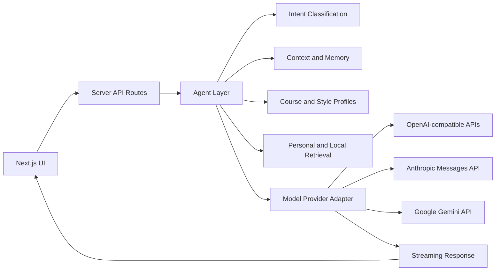

# Physics Learning Agent

<p align="center">
  <strong>A chat-style learning workspace for undergraduate physics.</strong>
</p>

<p align="center">
  <a href="#highlights">Highlights</a> |
  <a href="#core-workflows">Core Workflows</a> |
  <a href="#model-providers">Model Providers</a> |
  <a href="#personal-knowledge-base">Personal Knowledge Base</a> |
  <a href="#architecture">Architecture</a> |
  <a href="#getting-started">Getting Started</a>
</p>

<p align="center">
  
  
  
  
</p>

Physics Learning Agent is a focused study environment for undergraduate physics. It brings together a clean ChatGPT-style interface, structured course knowledge, original practice problem generation, personal note retrieval, Markdown and LaTeX rendering, and multi-provider model access.

The project is built for long-form learning workflows: asking conceptual questions, checking derivations, generating practice problems, following up on previous explanations, and grounding answers in user-owned notes or course materials.

## Highlights

- Chat-style physics learning workspace with local conversation history
- Undergraduate physics knowledge map with formulas, prerequisites, related topics, and common pitfalls
- Original practice problem generation with difficulty, count, language, source-style, and output-mode controls
- Folded practice cards with hints, solutions, and answers hidden by default
- Export generated practice sets as editable `.tex` files
- Personal knowledge base for user-owned notes, problem sets, and course materials
- Lightweight local account system for small-group or local deployments
- Retrieval-augmented answers from indexed personal notes
- Bring Your Own Key support for OpenAI, DeepSeek, Qwen, Kimi, GLM, Claude, Gemini, OpenRouter, and custom compatible providers
- Markdown, LaTeX, tables, and code rendering across chat, knowledge pages, and practice results
- Per-session streaming isolation to prevent cross-conversation output leaks

## Core Workflows

### Chat

The chat workspace is optimized for physics learning rather than generic short answers. It keeps recent conversation context, tracks learning memory, supports answer-depth preferences, and adapts the response style to the user question.

Physics-related questions are handled with a teaching-oriented structure: definitions, assumptions, equations, derivation steps, applicability, checks, and common pitfalls. General questions are answered directly without forcing a physics template.

### Knowledge Map

The knowledge map covers the standard undergraduate physics sequence:

- General Physics and Physics Education
- Mathematical Methods for Physics
- Theoretical Mechanics
- Electrodynamics
- Quantum Mechanics
- Thermodynamics and Statistical Physics

Course metadata and topic definitions live in `src/data`, so the knowledge base can be extended without changing the application shell.

### Practice Problems

Practice Problems is the primary structured workflow. It supports:

- automatic language detection
- natural-language course and topic inference
- selectable source style:
  - Auto
  - Chinese textbook exercises
  - Chinese final exam
  - Chinese postgraduate entrance exam
  - English textbook exercises
  - Open-course problem set
- difficulty and problem-count controls
- output modes for questions only, hints, full solutions, or hidden answers
- folded cards for each generated problem
- context transfer from a generated problem into chat
- `.tex` export for generated problem sets

Generated problems are original variants. They may follow a broad source style, but they should not copy textbook, exam, MIT OpenCourseWare, or other open-course problem statements, and they should not be presented as official source material.

## Bilingual Learning Strategy

The product interface is English. The response language follows the user's question or explicit instruction.

For Chinese questions, the agent follows common Chinese undergraduate physics conventions: textbook terminology, after-chapter exercise structure, university final-exam style, and postgraduate-entrance-exam style.

For English questions, the agent follows English textbook and open-course conventions. The reference profiles are aligned with standard physics learning traditions such as Arfken, Boas, Goldstein, Taylor, Griffiths, Jackson, Sakurai, Shankar, Schroeder, Reif, Pathria, Callen, Kardar, and public open-course problem-set styles.

These references are used only as curriculum and style guidance. The repository does not include textbook content, official exam questions, or official open-course problem statements.

## Model Providers

Physics Learning Agent can use either a server-configured default provider or user-provided keys.

The server default is configured with environment variables:

```txt
DEEPSEEK_API_KEY=your_deepseek_api_key
DEEPSEEK_BASE_URL=https://api.deepseek.com
DEEPSEEK_MODEL=deepseek-chat
```

Users can also enable Bring Your Own Key mode from API Settings. Supported provider families include:

- OpenAI and GPT models
- DeepSeek
- Qwen through DashScope compatible mode
- Kimi through Moonshot
- GLM through Zhipu
- OpenRouter
- Claude through the Anthropic Messages API
- Gemini through the Google Gemini API
- Custom OpenAI-compatible `/chat/completions` endpoints

User-entered API keys are kept in the current browser tab's `sessionStorage`. They are forwarded only to the server route handling the active request and are not written to localStorage or server-side project files.

## Personal Knowledge Base

The Personal Knowledge page provides a lightweight local account system and a private document library. A user can create an account, sign in, upload study materials, and let the chat workflow retrieve relevant snippets from indexed files.

The current implementation is intentionally small and transparent:

- user records and session metadata are stored under `PLA_DATA_DIR`
- passwords are hashed with Node.js `scrypt`
- session tokens are stored as HTTP-only cookies
- Markdown, TXT, TeX, and CSV files are indexed into searchable chunks
- PDF, DOCX, and PPTX files can be stored in the catalog, but full text extraction is not enabled yet

For public deployments, replace the local JSON store with a production authentication provider, database, and object storage layer.

## Architecture



The main application areas are:

- `src/app` - Next.js App Router pages and API routes
- `src/components` - chat workspace, practice UI, layout, selectors, and shared rendering components
- `src/agent` - intent classification, memory summarization, workflow preparation, and learning-context helpers
- `src/data` - course metadata, knowledge items, recommendations, and reference profiles
- `src/lib` - model calls, provider adapters, prompt construction, storage, streaming, parsing, auth, personal knowledge, and export utilities
- `src/rag` - local Markdown samples, chunking, retrieval prototype, and extension notes
- `e2e` - Playwright coverage for primary UI workflows

## Tech Stack

- Next.js App Router
- React
- TypeScript
- Tailwind CSS
- Server-side model provider adapters
- React Markdown
- KaTeX
- Vitest
- Playwright

## Getting Started

Install dependencies:

```bash
npm install
```

Create `.env.local`:

```txt
DEEPSEEK_API_KEY=your_deepseek_api_key
DEEPSEEK_BASE_URL=https://api.deepseek.com
DEEPSEEK_MODEL=deepseek-chat
DEEPSEEK_THINKING=disabled
DEEPSEEK_TIMEOUT_MS=120000
PLA_DATA_DIR=.pla-data
```

Run the development server:

```bash
npm run dev
```

Open [http://localhost:3000](http://localhost:3000).

Build for production:

```bash
npm run build
```

## Scripts

```bash
npm run dev       # Start the development server
npm run build     # Create a production build
npm run start     # Start the production server
npm run lint      # Run ESLint
npm run test:run  # Run unit tests
npm run test:e2e  # Run Playwright tests
npm run test:all  # Run lint, unit tests, build, and E2E tests
```

## Security and Privacy

The server-configured API key is read only on the server side. Browser clients call internal routes such as `/api/chat` and `/api/deepseek/test`.

Conversation history, answer-depth preferences, and lightweight learning memory are stored in the current browser's `localStorage`. Personal knowledge-base accounts and uploaded document indexes are stored on the server under `PLA_DATA_DIR`. User-provided model keys in BYOK mode are kept in the current tab's `sessionStorage`.

This repository does not include a production database, remote user management, billing, or a hosted object-storage layer. Those should be added before running the project as a public multi-user service.

## RAG and Knowledge Retrieval

The retrieval layer currently combines:

- local Markdown samples in `src/rag/sample-docs`
- user-owned text documents uploaded through Personal Knowledge
- Markdown-style chunking
- keyword scoring
- source and heading citations in generated answers

A production retrieval layer can add PDF, DOCX, and PPTX text extraction, embeddings, hybrid retrieval, reranking, and a vector store such as LanceDB, Chroma, pgvector, or Supabase Vector.

## Source-Style and Copyright Notes

Generated explanations and practice problems are intended for learning support. For formal coursework, results should be checked against textbooks, lecture notes, and instructor requirements.

The project may ask the model to follow broad source styles such as "Chinese textbook exercise style" or "open-course problem-set style." It should not reproduce protected source text, copy official problems, claim textbook page numbers, or present generated problems as MIT OpenCourseWare or textbook originals.

Do not upload copyrighted textbooks or protected course materials to a public deployment unless you have the right to store and process that content.

## License

MIT
