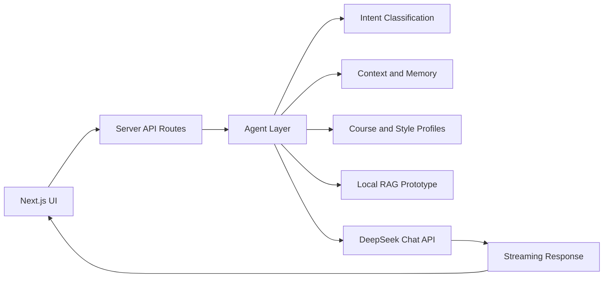

# Physics Learning Agent

<p align="center">
  <strong>A focused, chat-style workspace for undergraduate physics learning.</strong>
</p>

<p align="center">
  <a href="#overview">Overview</a> |
  <a href="#features">Features</a> |
  <a href="#practice-problems">Practice Problems</a> |
  <a href="#architecture">Architecture</a> |
  <a href="#getting-started">Getting Started</a>
</p>

<p align="center">
  
  
  
  
</p>

Physics Learning Agent is a minimal learning workspace for students working through undergraduate physics. It combines a clean chat interface, a structured knowledge map, original practice problem generation, Markdown and LaTeX rendering, lightweight local memory, and server-side DeepSeek integration.

The project is designed for long-form study: concept explanations, derivations, problem-solving guidance, generated exercises, and follow-up questions that preserve the current learning context.

## Overview

Physics Learning Agent is not a general chatbot wrapper. It adds a teaching-oriented layer around the model call:

- user intent detection for physics, mathematics, coding, writing, and general questions
- course and topic context for undergraduate physics workflows
- bilingual response behavior for Chinese and English learners
- source-style profiles for practice problem generation
- local conversation history and lightweight learning memory
- streamed responses with per-session request isolation
- Markdown, KaTeX, tables, and code blocks for technical answers

The interface is English. The response language follows the user's question or explicit instruction.

## Features

- Chat-style learning workspace with local conversation history
- Knowledge map for core undergraduate physics courses
- Practice problem generation with difficulty, count, style, and output controls
- Folded practice cards with hints, solutions, and answers hidden by default
- Export generated practice sets as editable `.tex` files
- Markdown and LaTeX rendering across chat, knowledge pages, and practice results
- Answer-depth preferences for concise answers, standard explanations, detailed derivations, and problem-solving oriented responses
- Server-side DeepSeek API calls through Next.js API routes
- Lightweight local memory using browser storage
- Local Markdown-based RAG prototype for future note retrieval

## Course Coverage

The workspace is organized around the standard undergraduate physics sequence:

- General Physics and Physics Education
- Mathematical Methods for Physics
- Theoretical Mechanics
- Electrodynamics
- Quantum Mechanics
- Thermodynamics and Statistical Physics

Course metadata and topic definitions live in `src/data`, so the knowledge base can be extended without changing the application shell.

## Bilingual Reference Strategy

Physics Learning Agent supports both Chinese and English study workflows while keeping the product interface in English.

For Chinese questions, the agent follows common Chinese undergraduate physics conventions: textbook terminology, after-chapter exercise structure, university final-exam style, and postgraduate-entrance-exam style. The reference tradition is aligned with widely used Chinese course structures for mathematical methods, theoretical mechanics, electrodynamics, quantum mechanics, and thermodynamics and statistical physics.

For English questions, the agent follows English textbook and open-course conventions. The reference profiles are aligned with standard physics learning traditions such as Arfken, Boas, Goldstein, Taylor, Griffiths, Jackson, Sakurai, Shankar, Schroeder, Reif, Pathria, Callen, Kardar, and public open-course problem-set styles.

These references are used only as curriculum and style guidance. The repository does not include textbook content, official exam questions, or official open-course problem statements.

## Practice Problems

Practice Problems is the primary structured workflow. It supports:

- automatic language detection
- natural-language course and topic inference
- selectable source style:
  - Auto
  - Chinese textbook exercises
  - Chinese final exam
  - Chinese postgraduate entrance exam
  - English textbook exercises
  - Open-course problem set
- difficulty and problem-count controls
- output modes for questions only, hints, full solutions, or hidden answers
- folded cards for each generated problem
- context transfer from a generated problem into chat
- `.tex` export for generated problem sets

Generated problems are original variants. They may follow a broad source style, but they should not copy textbook, exam, MIT OpenCourseWare, or other open-course problem statements, and they should not be presented as official source material.

## Architecture



The main application areas are:

- `src/app` - Next.js App Router pages and API routes
- `src/components` - chat workspace, practice UI, layout, selectors, and shared rendering components
- `src/agent` - intent classification, memory summarization, and learning-context helpers
- `src/data` - course metadata, knowledge items, recommendations, and reference profiles
- `src/lib` - model calls, prompt construction, storage, streaming, parsing, and export utilities
- `src/rag` - local Markdown sample documents, chunking, and retrieval prototype
- `e2e` - Playwright coverage for primary UI workflows

## Tech Stack

- Next.js App Router
- React
- TypeScript
- Tailwind CSS
- DeepSeek Chat API
- React Markdown
- KaTeX
- Vitest
- Playwright

## Getting Started

Install dependencies:

```bash
npm install
```

Create `.env.local`:

```txt
DEEPSEEK_API_KEY=your_deepseek_api_key
DEEPSEEK_BASE_URL=https://api.deepseek.com
DEEPSEEK_MODEL=deepseek-chat
DEEPSEEK_TIMEOUT_MS=120000
```

Run the development server:

```bash
npm run dev
```

Open [http://localhost:3000](http://localhost:3000).

Build for production:

```bash
npm run build
```

## Scripts

```bash
npm run dev       # Start the development server
npm run build     # Create a production build
npm run start     # Start the production server
npm run lint      # Run ESLint
npm run test:run  # Run unit tests
npm run test:e2e  # Run Playwright tests
npm run test:all  # Run lint, unit tests, build, and E2E tests
```

## API and Privacy

The DeepSeek API key is read only on the server side. The browser calls internal routes such as `/api/chat` and `/api/deepseek/test`; it never receives the API key.

Conversation history, answer-depth preferences, and lightweight learning memory are stored in the current browser's `localStorage`. The project does not include accounts, a remote user database, or a payment system.

## RAG Prototype

The RAG prototype in `src/rag` uses local Markdown files, text chunking, and keyword retrieval to validate the basic flow of note retrieval, context injection, and source display.

A production retrieval layer can add user-owned Markdown, PDF, or LaTeX notes, embeddings, and a vector store such as LanceDB, Chroma, pgvector, or Supabase Vector. Copyrighted textbook content should not be committed to a public repository.

## Source-Style and Copyright Notes

Generated explanations and practice problems are intended for learning support. For formal coursework, results should be checked against textbooks, lecture notes, and instructor requirements.

The project may ask the model to follow broad source styles such as "Chinese textbook exercise style" or "open-course problem-set style." It should not reproduce protected source text, copy official problems, claim textbook page numbers, or present generated problems as MIT OpenCourseWare or textbook originals.

## License

MIT
