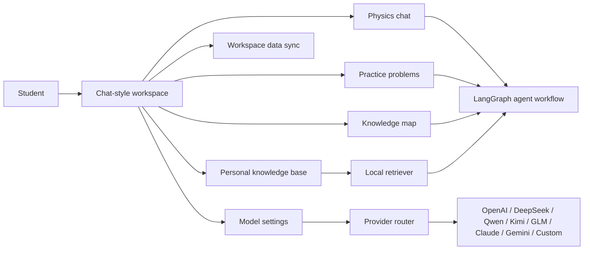
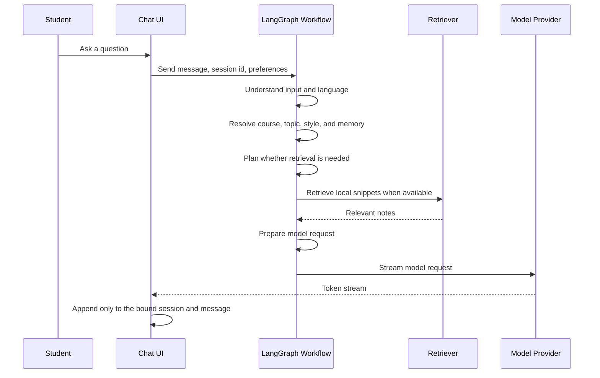
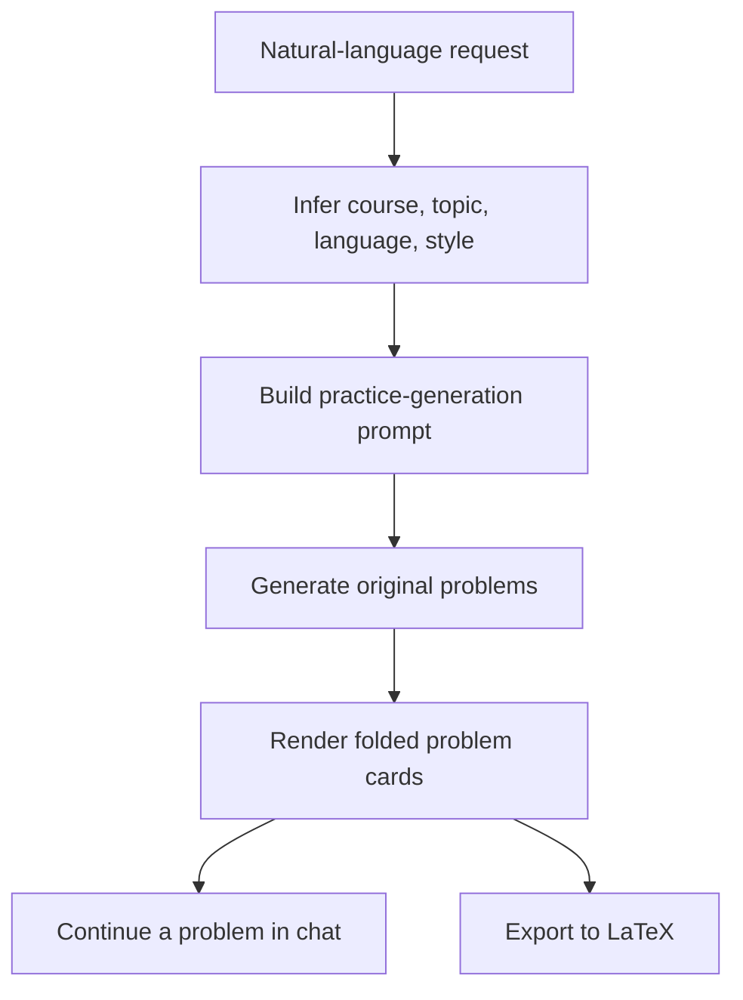
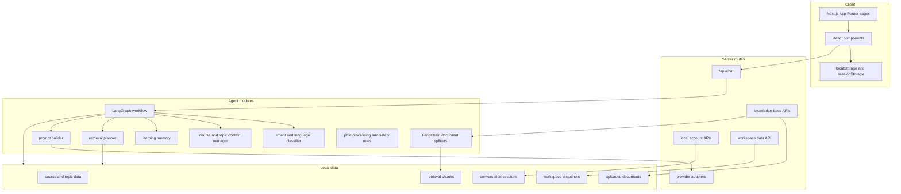
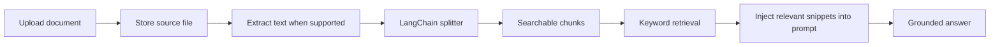

<p align="center">
  
</p>

<h1 align="center">Physics Learning Agent</h1>

<p align="center">
  <strong>A LangGraph-orchestrated learning workspace for undergraduate physics.</strong>
</p>

<p align="center">
  <a href="#overview">Overview</a> |
  <a href="#features">Features</a> |
  <a href="#learning-workflows">Workflows</a> |
  <a href="#architecture">Architecture</a> |
  <a href="#personal-knowledge-base">Knowledge Base</a> |
  <a href="#getting-started">Getting Started</a>
</p>

<p align="center">
  
  
  
  
  
  
  
</p>

Physics Learning Agent is a chat-style study workspace for undergraduate physics. It combines conversational tutoring, structured course knowledge, original practice problem generation, personal document retrieval, and multi-provider model access in a restrained interface designed for long reading sessions.

The project is built around two primary workflows:

1. Learn through conversation: ask conceptual questions, follow derivations, debug mistakes, and continue from previous context.
2. Train through problems: generate original practice sets with hidden hints, solutions, answers, and LaTeX export.

It is not a generic chatbot wrapper. The application adds a learning layer around model calls: a LangGraph-orchestrated workflow, intent classification, course-aware prompting, language-aware reference profiles, LangChain-based document chunking, retrieval from user-owned materials, account-scoped workspace memory, and strict streaming isolation between sessions.

## Overview



| Area | What it provides |
| --- | --- |
| Chat workspace | Long-form physics tutoring, follow-up questions, context memory, streaming answers |
| Practice Problems | Original problem sets with difficulty, style, language, hidden answers, and `.tex` export |
| Knowledge Map | Course topics, prerequisites, related topics, formulas, typical problems, and pitfalls |
| Personal Knowledge Base | User-owned notes and materials indexed for local retrieval |
| Agent Workflow | LangGraph nodes for input understanding, context resolution, memory update, retrieval planning, retrieval execution, and generation preparation |
| Workspace Persistence | Conversations, active session, practice history, learning memory, and safe preferences saved per signed-in user |
| Model Providers | Server-side default model plus browser-side user keys for multiple providers |
| Rendering | Markdown, LaTeX, tables, code blocks, and long formulas with overflow protection |

## Features

### Study-first chat

- ChatGPT-style conversation layout with a persistent input area and scrollable message history
- Session history stored locally in the browser and synced to the signed-in account workspace
- Request isolation across conversations so stale streaming output cannot leak into another session
- Answer depth preferences: concise, standard, detailed, derivation-first, or problem-type-first
- Normal handling of non-physics questions, with a light final note that the workspace is optimized for physics learning
- Account-scoped persistence for conversations, active session, learning memory, and safe model preferences
- Personal knowledge modes for chat: automatic retrieval, always-on retrieval, or retrieval disabled

### Physics-aware answer generation

- LangGraph workflow before generation:
  - input understanding
  - course and topic context resolution
  - learning-memory update
  - personal-knowledge retrieval planning
  - retrieval execution
  - prompt-ready request preparation
- Intent classification before prompt construction
- Course-aware response instructions for:
  - general physics
  - mathematical methods for physics
  - theoretical mechanics
  - electrodynamics
  - quantum mechanics
  - thermodynamics and statistical physics
- Bilingual response behavior:
  - Chinese questions receive Chinese answers and Chinese-course reference style
  - English questions receive English answers and English-textbook reference style
  - explicit user language requests take priority

### Practice problem generation

- Automatic language and topic inference from natural-language requests
- Source-style control:
  - Auto
  - Chinese textbook exercises
  - Chinese final exam
  - Chinese postgraduate entrance exam
  - English textbook exercises
  - Open-course problem set
- Difficulty and count controls
- Output modes:
  - questions only
  - questions with hints
  - full solutions
  - hints with answers hidden by default
- Per-problem folded cards for hints, solutions, and final answers
- One-click follow-up from a generated problem into chat with context attached
- Export generated problem sets as editable LaTeX source

### Personal knowledge base

- Local account flow for small-group or personal deployments
- Upload user-owned notes, problem sets, handouts, or course materials
- LangChain document splitters for Markdown, LaTeX, and plain text indexing
- Markdown, text, TeX, and CSV extraction for retrieval
- PDF, DOCX, and PPTX files are stored as source documents and can be extended with richer parsers later
- Chat can use the personal library in three modes:
  - `Auto`: retrieve only when the message clearly refers to uploaded materials or follows up on personal-library context
  - `Always`: retrieve from the signed-in user's personal library on every turn
  - `Off`: answer without personal-library retrieval
- Retrieval snippets are injected into the answer context only for the signed-in user who owns the documents
- No vector database is required for the current implementation

### Workspace data persistence

- Signed-in users get a server-side workspace snapshot under `PLA_DATA_DIR`
- Persisted data includes chat conversations, active conversation, learning memory, answer-depth preference, onboarding state, non-secret provider preferences, and generated practice history
- Browser storage remains available for anonymous use and is merged into the account snapshot after sign-in
- Provider API keys are intentionally excluded from persistent workspace data

### Bring Your Own Key model access

- Use the server-configured default model, or provide a temporary browser-side key for another provider
- Supported provider routes:
  - OpenAI-compatible APIs
  - DeepSeek
  - Qwen
  - Kimi
  - GLM
  - OpenRouter
  - Anthropic Claude
  - Google Gemini
  - custom compatible endpoint
- User-provided API keys are kept in `sessionStorage`; they are not written to project files or local persistent storage by default

## Learning Workflows

### Conversation workflow



### Practice workflow



## Course Coverage

| Course | Representative topics |
| --- | --- |
| General Physics | units and vectors, Newtonian mechanics, circular motion, gravitation, fluids, oscillations and waves, thermal physics, electromagnetism, circuits, geometrical optics, modern physics, measurement, uncertainty |
| Mathematical Methods for Physics | vector analysis, curvilinear coordinates, complex variables, Fourier analysis, integral transforms, distributions, PDEs, boundary-value problems, Sturm-Liouville theory, Green's functions, special functions, asymptotic methods |
| Theoretical Mechanics | particle systems, central forces, rigid-body kinematics and dynamics, non-inertial frames, constraints, virtual work, Lagrange equations, Hamilton's principle, canonical equations, Poisson brackets, canonical transformations, Hamilton-Jacobi theory, small oscillations |
| Electrodynamics | electrostatics, magnetostatics, fields in matter, boundary-value problems, image method, multipole expansion, Maxwell equations, electromagnetic boundary conditions, waves, waveguides, potentials, gauge transformations, radiation, relativistic electrodynamics |
| Quantum Mechanics | wave functions, state vectors, Hilbert space, Dirac notation, postulates, operators, representations, one-dimensional systems, harmonic oscillator, central-force problems, angular momentum, spin, identical particles, perturbation theory, WKB, scattering basics, density matrices |
| Thermodynamics and Statistical Physics | equilibrium, thermodynamic laws, state functions, thermodynamic potentials, Maxwell relations, chemical potential, phase equilibrium, ensembles, partition functions, classical statistics, quantum statistics, Bose condensation, degenerate Fermi gas, fluctuations, critical phenomena |

## Reference Strategy

Physics Learning Agent uses reference profiles to adapt wording and problem style without copying protected source material.

| User context | Reference profile | Output style |
| --- | --- | --- |
| Chinese questions | Chinese undergraduate physics curriculum, final exams, postgraduate entrance exam conventions | Chinese undergraduate-course terminology, complete conditions, standard derivations, original exercise variants |
| English questions | English textbook conventions and open-course problem-set style | Academic English, textbook-style assumptions, original problem sets, clear solution structure |
| Mixed-language context | Most recent explicit user language and task intent | Preserve the active learning context unless the user changes it |

Generated problems are original. The project does not copy textbook exercises, examination questions, or MIT OpenCourseWare problem statements, and it does not claim generated content is official course material.

## Architecture



### Key directories

| Path | Purpose |
| --- | --- |
| `src/app` | App Router pages and API routes |
| `src/components` | Chat, layout, practice, knowledge map, settings, and shared UI components |
| `src/agent` | LangGraph workflow, intent classification, memory, retrieval decisions, model config, and response post-processing |
| `src/data` | Course metadata, knowledge topics, recommendations, and prompt-related data |
| `src/lib` | Provider clients, prompt builder, session storage, user-data sync, personal knowledge indexing, recommendations, and utilities |
| `src/types` | Shared TypeScript types |
| `src/rag` | LangChain-backed chunking, lightweight retrieval utilities, and sample notes |

## Personal Knowledge Base



The current knowledge base is intentionally lightweight. It uses LangChain for document abstraction and splitting, then applies local keyword retrieval over generated chunks. Chat requests can automatically decide whether personal retrieval is needed, while still giving users explicit control through Auto, Always, and Off modes. The implementation is suitable for personal notes, course summaries, handouts, problem sets, and self-authored explanations. A production-grade retrieval stack can later add LangChain loaders, embeddings, vector indexes, reranking, and citation-aware answer generation.

## Model Providers

| Provider path | Notes |
| --- | --- |
| Server default | Uses environment variables and keeps the API key server-side |
| OpenAI-compatible | Works with OpenAI-style `/chat/completions` providers |
| Anthropic Claude | Uses the Claude messages API |
| Google Gemini | Uses the Gemini generation API |
| Custom endpoint | For compatible local or hosted model gateways |

The application separates provider configuration from the learning workflow. This makes it possible to keep a default model for deployment while allowing advanced users to test their own providers from the settings page.

## Getting Started

### Prerequisites

- Node.js 20 or later
- npm
- A model provider key, such as DeepSeek, OpenAI, Qwen, Claude, Gemini, or another compatible provider

### Install

```bash
npm install
```

### Configure environment variables

Create `.env.local`:

```txt
DEEPSEEK_API_KEY=your_deepseek_api_key
DEEPSEEK_BASE_URL=https://api.deepseek.com
DEEPSEEK_MODEL=deepseek-chat
```

The server-side DeepSeek configuration is optional if users only rely on browser-provided keys in the settings page, but a server-side default is recommended for a smoother local setup.

### Run locally

```bash
npm run dev
```

Open [http://localhost:3000](http://localhost:3000).

### Build

```bash
npm run build
```

## Scripts

| Command | Description |
| --- | --- |
| `npm run dev` | Start the development server |
| `npm run build` | Build the production application |
| `npm run start` | Start the production server |
| `npm run lint` | Run lint checks |
| `npm run test:run` | Run the test suite, if configured in the current checkout |

## Security and Privacy

- Server-side provider keys are read from environment variables and are never exposed to client code.
- Browser-entered provider keys are kept in `sessionStorage` for the active browser session.
- Anonymous conversation history and study state are stored in the browser.
- Signed-in workspace data is saved under `PLA_DATA_DIR`, including conversations, practice history, learning memory, and safe preferences.
- API keys entered through Bring Your Own Key mode are not written to the account workspace snapshot.
- The personal knowledge base is designed for user-owned learning materials.
- Do not upload copyrighted textbooks or private course materials to a public deployment unless you have the right to do so.
- The built-in local account system is intended for personal or small-group deployments, not as a hardened enterprise identity system.

## Roadmap

- Richer document extraction for PDF, DOCX, and PPTX
- Embedding-based retrieval with a pluggable vector store
- Citation-aware answers for user-owned notes
- Better export formats for practice sets and study records
- Structured problem-set authoring tools for instructors and study groups
- More structured test coverage for streaming, retrieval, and provider adapters

## Copyright and Source-style Notes

The project can generate exercises in the style of common textbook or open-course problem sets, but generated problems should be treated as original variants. It should not be used to copy protected problem statements, reproduce textbook content, or imply official affiliation with any textbook, university, or course.

## License

MIT
