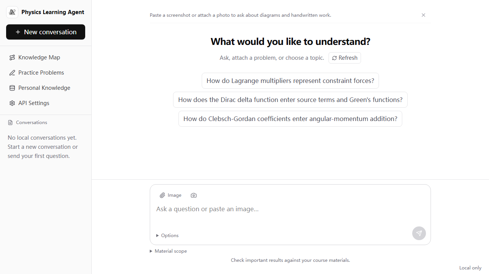
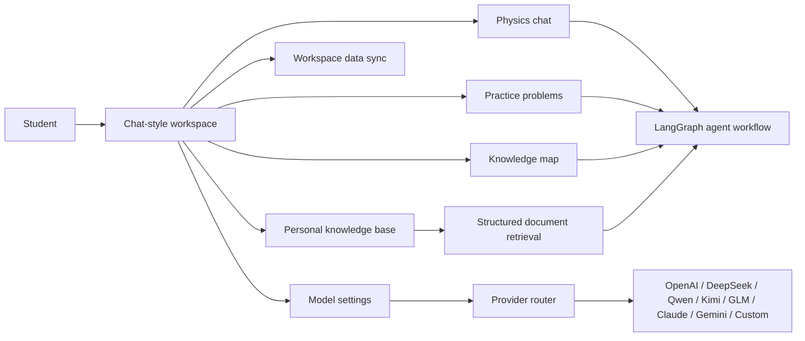
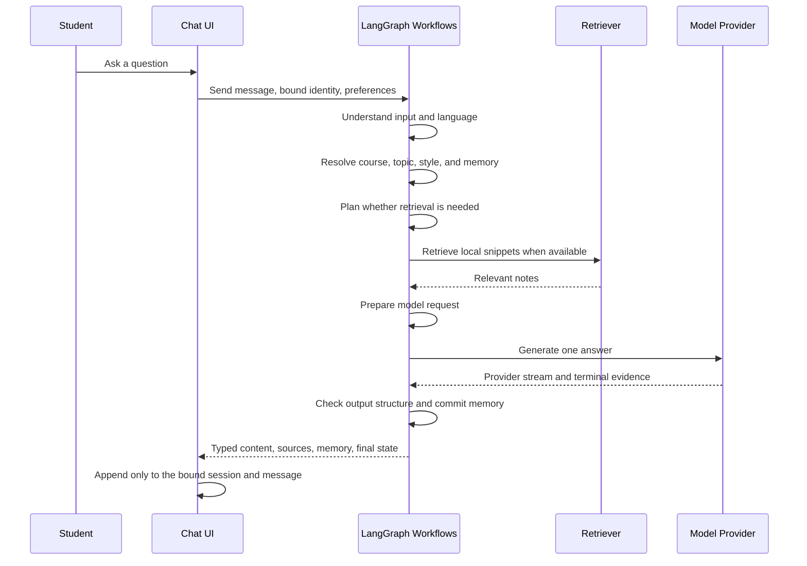
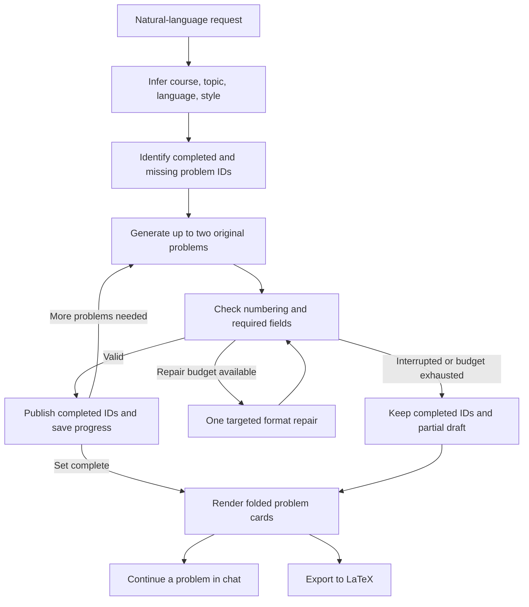
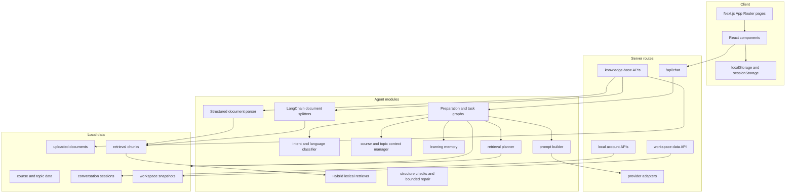

<p align="center">
  
</p>

<h1 align="center">Physics Learning Agent</h1>

<p align="center">
  <strong>A LangGraph-orchestrated learning workspace for undergraduate physics.</strong>
</p>

<p align="center">
  <a href="#overview">Overview</a> |
  <a href="#features">Features</a> |
  <a href="#learning-workflows">Workflows</a> |
  <a href="#architecture">Architecture</a> |
  <a href="#personal-knowledge-base">Knowledge Base</a> |
  <a href="#pilot-deployment">Pilot Deployment</a> |
  <a href="#getting-started">Getting Started</a> |
  <a href="CONTRIBUTING.md">Contributing</a>
</p>

<p align="center">
  
  
  
  
  
  
  <a href="https://github.com/lizr-phys/physics-learning-agent/actions/workflows/ci.yml"></a>
  <a href="LICENSE"></a>
</p>

<p align="center">
  
</p>

Physics Learning Agent is a study workspace for undergraduate physics, with text and image conversations, structured course knowledge, original practice problems, personal document retrieval, and multi-provider model access. Compact pages keep the main task visible and place optional controls in expandable sections.

The project is built around two primary workflows:

1. Learn through conversation: ask conceptual questions, follow derivations, debug mistakes, and continue from previous context.
2. Train through problems: generate original practice sets with hidden hints, solutions, answers, and LaTeX export.

The learning layer combines course-aware prompts, explicit language and context choices, LangChain document chunking, inspectable personal sources, and bounded LangGraph tasks. Conversations and practice sets remain available in separate anonymous and account workspaces.

## Overview


```mermaid
flowchart LR
  Student["Student"] --> Workspace["Chat-style workspace"]
  Workspace --> Chat["Physics chat"]
  Workspace --> Practice["Practice problems"]
  Workspace --> Map["Knowledge map"]
  Workspace --> KB["Personal knowledge base"]
  Workspace --> DataSync["Workspace data sync"]
  Workspace --> Settings["Model settings"]

  Chat --> Agent["LangGraph agent workflow"]
  Practice --> Agent
  Map --> Agent
  KB --> Retriever["Structured document retrieval"]
  Retriever --> Agent
  Settings --> Router["Provider router"]
  Router --> Models["OpenAI / DeepSeek / Qwen / Kimi / GLM / Claude / Gemini / Custom"]
```

| Area | What it provides |
| --- | --- |
| Chat workspace | Long-form physics tutoring, follow-up questions, context memory, streaming answers, and answer feedback |
| Practice Problems | Original problem sets with difficulty, style, language, hidden answers, self-assessment, and `.tex` export |
| Knowledge Map | Course topics, prerequisites, related topics, formulas, typical problems, and pitfalls |
| Personal Knowledge Base | User-owned notes and course materials parsed into metadata-rich, citation-ready chunks |
| Agent Workflow | Request preparation followed by task planning, generation, structure checks, bounded practice repair, and final memory commit |
| Workspace Persistence | Conversations, active session, practice history, learning memory, and safe preferences saved per signed-in user |
| Model Providers | Server-side default model plus browser-side user keys for multiple providers |
| Rendering | Markdown, LaTeX, tables, code blocks, and long formulas with overflow protection |

## Features

### Study-first chat

- ChatGPT-style conversation layout with a persistent input area and scrollable message history
- Session history stored locally in the browser and synced to the signed-in account workspace
- Generation binding to the account, authentication epoch, conversation, assistant message, and request
- Answer depth preferences: concise, standard, detailed, derivation-first, or problem-type-first
- Normal handling of non-physics questions, with a light final note that the workspace is optimized for physics learning
- Account-scoped persistence for conversations, active session, learning memory, and safe model preferences
- Personal knowledge modes for chat: automatic retrieval, always-on retrieval, or retrieval disabled
- A compact useful / needs-improvement signal attached to each completed answer
- Explicit complete, truncated, interrupted, and cancelled states with partial output retained for continuation or retry

### Physics-aware answer generation

- A request-preparation graph resolves intent, current context, retrieval, and a shared context budget
- A task graph handles direct answers or small practice batches, validates output structure, and commits completed-answer memory
- Ordinary questions use one generation call; practice tasks may use one format repair within a shared time and output budget
- Rule-based intent routing for conceptual questions, review requests, study planning, practice generation, and non-physics input
- Course-aware response instructions for:
  - general physics
  - mathematical methods for physics
  - theoretical mechanics
  - electrodynamics
  - quantum mechanics
  - thermodynamics and statistical physics
- Bilingual response behavior:
  - Chinese questions receive Chinese answers and Chinese-course reference style
  - English questions receive English answers and English-textbook reference style
  - explicit user language requests take priority

Current explicit instructions take priority over remembered course, language, and problem style. Context fields record where their values came from. Recent complete turns, the selected problem, formula conditions, and source-tagged conversation summaries share one allocation; provider adapters do not clip that history again. Prior assistant explanations remain marked as unverified.

### Image questions and practice

Attach a photo, paste a screenshot, or use the camera picker in Chat and Practice Problems. Ask about diagrams, graph axes, handwritten steps or visible conditions; images stay available for follow-up questions and unfinished practice recovery. Image-based practice creates original variations rather than copying the pictured exercise.

The default model ID is `deepseek-flash`, the official API name for DeepSeek V4.1 Flash. DeepSeek's older Flash aliases remain selectable. OpenAI-compatible, Anthropic and Gemini adapters forward images through their native content parts; the selected model must support vision. DeepSeek Pro rejects image requests with a visible explanation. See the official [DeepSeek vision guide](https://api-docs.deepseek.com/guides/vision/) and [model reference](https://api-docs.deepseek.com/quick_start/pricing/).

Images are stored privately under `PLA_DATA_DIR`, separately for each account and the browser's anonymous workspace. Signing in offers an explicit copy of anonymous records and their images. Account switching cancels old uploads and generation. Workspace exports contain image references; use API Settings → Workspace data → Manage images to save image copies or remove unused uploads.

In Personal Knowledge Base, **Photo problems** organizes photographed exams and homework. Choose a category, attach images, and let the selected vision model transcribe questions, conditions, diagram descriptions and unclear details without inventing a solution. Review or edit the text and explicitly confirm it before saving. The library retains the source images and user source note alongside an indexed Markdown document. Filter exam/homework photos, reopen the note, or carry its text, images and document scope into Chat. Recognition drafts survive page navigation and refresh in the account's browser cache; completed notes live in the private server library. Duplicate save retries reuse the same record. Review confirms transcription only, not physics correctness.

Limits are four images per message and eight unique images per request, including history. JPEG, PNG, WebP and GIF inputs must be at most 10 MB and 25 megapixels. Images are rotated, stripped of metadata, resized to at most 2560 pixels per side, and stored as WebP up to 2 MB each. GIF uses its first frame. Each workspace has a 50 MB / 256-image allowance. Crop small handwriting when needed; unreadable values should prompt clarification. Audio, video, native PDF vision, automatic OCR ingestion and provider Files API storage are not implemented.

### Practice problem generation

- Automatic language and topic inference from natural-language requests
- Source-style control:
  - Auto
  - Chinese textbook exercises
  - Chinese final exam
  - Chinese postgraduate entrance exam
  - English textbook exercises
  - Open-course problem set
- Difficulty and count controls
- Output modes:
  - questions only
  - questions with hints
  - full solutions
  - hints with answers hidden by default
- Per-problem folded cards for hints, solutions, and final answers
- Per-problem `Solved` and `Needs work` self-assessment stored with the generated set
- Stable problem IDs, optional attempt drafts and stuck-step notes, and progress saved by completed problem IDs
- Small batches for longer sets, with reload recovery that rechecks completed blocks before generating missing problems
- One-click follow-up from a generated problem into chat with context attached
- Export generated problem sets as editable LaTeX source

### Personal knowledge base

- Local account flow for small-group or personal deployments
- Upload user-owned notes, problem sets, handouts, or course materials
- LangChain document splitters for Markdown, LaTeX, and plain text indexing
- Structured extraction for text-based PDF, DOCX, PPTX, XLSX, RTF, and OpenDocument files
- Course and topic metadata for context-aware retrieval
- BM25, phrase, heading, and metadata score fusion with duplicate suppression
- Page, slide, sheet, and section locators when the source format exposes them
- Reindexing for existing files as the retrieval pipeline evolves
- Content hashes and document versions with stable source IDs
- Document and current-course scopes, plus original excerpt inspection from answer citations
- Chat can use the personal library in three modes:
  - `Auto`: retrieve only when the message clearly refers to uploaded materials or follows up on personal-library context
  - `Always`: retrieve from the signed-in user's personal library on every turn
  - `Off`: answer without personal-library retrieval
- Retrieval snippets are injected into the answer context only for the signed-in user who owns the documents
- Retrieval requires relevant text evidence; a matching course tag alone cannot admit a snippet
- Status distinguishes retrieval disabled, sign-in required, no match, retrieved sources, and retrieval failure
- Retrieved claims use citation-aware prompt instructions and supplied source locators; users can inspect the excerpts actually sent to the model
- No vector database is required for local development; the scorer accepts optional dense-vector scores for a future pgvector backend

### Workspace data persistence

- Signed-in users get a server-side workspace snapshot under `PLA_DATA_DIR`
- Persisted data includes chat conversations, answer feedback, active conversation, learning memory, answer-depth preference, onboarding state, non-secret provider preferences, generated practice history, and per-problem self-assessment
- Anonymous and account browser caches use separate namespaces. Signing out loads the anonymous workspace; account caches remain on that browser for later access
- Anonymous and unassigned legacy records can be copied into an account only through the explicit import choice. Choosing `Keep separate` leaves them in place
- Account changes cancel generation and sync work, invalidate old callbacks, and clear temporary provider keys
- Conditional revisions, operation IDs, and deletion markers protect against stale writes and deleted-record replay. Independent edits are merged; divergent content is kept in conflict copies
- The workspace holds up to 80 conversations and 80 practice sets, with 240 messages per conversation. Quota or browser-storage failures are visible instead of trimming old records
- Concurrent browser edits use per-tab journals and conditional acknowledgements. A record supports up to 16 unacknowledged writers; synchronization or explicit export/removal is required when that limit is reached
- `Saved`, `Saving`, `Offline`, `Sync failed`, and `Local only` show persistence state. Offline browser caches require successful synchronization when connectivity returns
- Provider API keys are intentionally excluded from persistent workspace data

### Pilot quality loop

- Completed answers can be marked as useful or needing improvement, with optional issue categories for clarity, formulas, or sources
- Generated problems can be marked as solved or needing more work without exposing the answer by default
- Anonymous feedback remains in browser storage; signed-in feedback follows the existing account-scoped workspace snapshot
- A deterministic offline baseline checks intent routing, course resolution, and bundled-note retrieval without spending model tokens
- Evaluation fixtures are designed to grow from anonymized pilot failure patterns rather than one-off prompt tuning
- API Settings provides a private workspace export, a feedback-summary export, and synchronization conflict details
- The summary includes retained feedback counts, terminal states, retrieval states, and available timing/token measurements; it excludes identities and learning text

Exports are initiated by the user; no analytics are sent automatically. Stored feedback and self-assessment are weak learning signals, and format checks do not verify physics answers. See [Pilot Evaluation](docs/pilot-evaluation.md) for report generation and the unfilled human-review record.

### Bring Your Own Key model access

- Use the server-configured default model, or provide a temporary browser-side key for another provider
- Supported provider routes:
  - OpenAI-compatible APIs
  - DeepSeek
  - Qwen
  - Kimi
  - GLM
  - OpenRouter
  - Anthropic Claude
  - Google Gemini
  - custom compatible endpoint
- User-provided API keys are kept in `sessionStorage`; they are not written to project files or local persistent storage by default
- Selected personal excerpts are sent to the chosen model provider when retrieval is used; the knowledge-base interface explains that data flow

## Learning Workflows

### Conversation workflow


```mermaid
sequenceDiagram
  participant U as Student
  participant UI as Chat UI
  participant A as LangGraph Workflows
  participant R as Retriever
  participant M as Model Provider

  U->>UI: Ask a question
  UI->>A: Send message, bound identity, preferences
  A->>A: Understand input and language
  A->>A: Resolve course, topic, style, and memory
  A->>A: Plan whether retrieval is needed
  A->>R: Retrieve local snippets when available
  R-->>A: Relevant notes
  A->>A: Prepare model request
  A->>M: Generate one answer
  M-->>A: Provider stream and terminal evidence
  A->>A: Check output structure and commit memory
  A-->>UI: Typed content, sources, memory, final state
  UI->>UI: Append only to the bound session and message
```

### Practice workflow


```mermaid
flowchart TD
  Request["Natural-language request"] --> Parse["Infer course, topic, language, style"]
  Parse --> Plan["Identify completed and missing problem IDs"]
  Plan --> Model["Generate up to two original problems"]
  Model --> Check["Check numbering and required fields"]
  Check -->|Valid| Save["Publish completed IDs and save progress"]
  Check -->|Repair budget available| Repair["One targeted format repair"]
  Repair --> Check
  Check -->|Interrupted or budget exhausted| Partial["Keep completed IDs and partial draft"]
  Save -->|More problems needed| Model
  Save -->|Set complete| Cards["Render folded problem cards"]
  Partial --> Cards
  Cards --> FollowUp["Continue a problem in chat"]
  Cards --> Export["Export to LaTeX"]
```

## Course Coverage

| Course | Representative topics |
| --- | --- |
| General Physics | units and vectors, Newtonian mechanics, circular motion, gravitation, fluids, oscillations and waves, thermal physics, electromagnetism, circuits, geometrical optics, modern physics, measurement, uncertainty |
| Mathematical Methods for Physics | vector analysis, curvilinear coordinates, complex variables, Fourier analysis, integral transforms, distributions, PDEs, boundary-value problems, Sturm-Liouville theory, Green's functions, special functions, asymptotic methods |
| Theoretical Mechanics | particle systems, central forces, rigid-body kinematics and dynamics, non-inertial frames, constraints, virtual work, Lagrange equations, Hamilton's principle, canonical equations, Poisson brackets, canonical transformations, Hamilton-Jacobi theory, small oscillations |
| Electrodynamics | electrostatics, magnetostatics, fields in matter, boundary-value problems, image method, multipole expansion, Maxwell equations, electromagnetic boundary conditions, waves, waveguides, potentials, gauge transformations, radiation, relativistic electrodynamics |
| Quantum Mechanics | wave functions, state vectors, Hilbert space, Dirac notation, postulates, operators, representations, one-dimensional systems, harmonic oscillator, central-force problems, angular momentum, spin, identical particles, perturbation theory, WKB, scattering basics, density matrices |
| Thermodynamics and Statistical Physics | equilibrium, thermodynamic laws, state functions, thermodynamic potentials, Maxwell relations, chemical potential, phase equilibrium, ensembles, partition functions, classical statistics, quantum statistics, Bose condensation, degenerate Fermi gas, fluctuations, critical phenomena |

## Reference Strategy

Physics Learning Agent uses reference profiles to adapt wording and problem style without copying protected source material.

| User context | Reference profile | Output style |
| --- | --- | --- |
| Chinese questions | Chinese undergraduate physics curriculum, final exams, postgraduate entrance exam conventions | Chinese undergraduate-course terminology, complete conditions, standard derivations, original exercise variants |
| English questions | English textbook conventions and open-course problem-set style | Academic English, textbook-style assumptions, original problem sets, clear solution structure |
| Mixed-language context | Most recent explicit user language and task intent | Preserve the active learning context unless the user changes it |

Generated problems are original. The project does not copy textbook exercises, examination questions, or MIT OpenCourseWare problem statements, and it does not claim generated content is official course material.

## Architecture


```mermaid
flowchart TB
  subgraph Client["Client"]
    Pages["Next.js App Router pages"]
    Components["React components"]
    LocalState["localStorage and sessionStorage"]
  end

  subgraph Server["Server routes"]
    ChatAPI["/api/chat"]
    ProviderAPI["provider adapters"]
    KBAPI["knowledge-base APIs"]
    AuthAPI["local account APIs"]
    UserDataAPI["workspace data API"]
  end

  subgraph Agent["Agent modules"]
    Graph["Preparation and task graphs"]
    Classifier["intent and language classifier"]
    Context["course and topic context manager"]
    Memory["learning memory"]
    RetrievalPlan["retrieval planner"]
    LC["LangChain document splitters"]
    Parser["Structured document parser"]
    Search["Hybrid lexical retriever"]
    PromptBuilder["prompt builder"]
    PostProcess["structure checks and bounded repair"]
  end

  subgraph Data["Local data"]
    Courses["course and topic data"]
    Sessions["conversation sessions"]
    WorkspaceData["workspace snapshots"]
    Docs["uploaded documents"]
    Chunks["retrieval chunks"]
  end

  Pages --> Components
  Components --> LocalState
  Components --> ChatAPI
  ChatAPI --> Graph
  Graph --> Classifier
  Graph --> Context
  Graph --> Memory
  Graph --> RetrievalPlan
  RetrievalPlan --> Data
  Graph --> PromptBuilder
  PromptBuilder --> ProviderAPI
  Graph --> Data
  KBAPI --> Docs
  KBAPI --> LC
  KBAPI --> Parser
  LC --> Chunks
  Parser --> Chunks
  Chunks --> Search
  AuthAPI --> Sessions
  UserDataAPI --> WorkspaceData
```

### Key directories

| Path | Purpose |
| --- | --- |
| `src/app` | App Router pages and API routes |
| `src/components` | Chat, layout, practice, knowledge map, settings, and shared UI components |
| `src/agent` | LangGraph workflow, intent classification, memory, retrieval decisions, model config, and response post-processing |
| `src/data` | Course metadata, knowledge topics, recommendations, and prompt-related data |
| `src/lib` | Provider clients, prompt builder, session storage, user-data sync, personal knowledge indexing, recommendations, and utilities |
| `src/types` | Shared TypeScript types |
| `src/rag` | Document extraction, LangChain-backed chunking, lexical retrieval, evaluation, and sample notes |

For a detailed request lifecycle, state model, retrieval design, and deployment boundary, see [Architecture](docs/architecture.md). A printable LaTeX version is available in [project-architecture.tex](docs/project-architecture.tex).

## Personal Knowledge Base


```mermaid
flowchart LR
  Upload["Upload document"] --> Store["Store source file"]
  Store --> Extract["Format-aware extraction"]
  Extract --> Chunk["Metadata-rich chunks"]
  Chunk --> Search["BM25 + phrase + metadata retrieval"]
  Search --> Gate["Text relevance admission"]
  Gate --> Select["Diversity selection"]
  Select --> Context["Original source excerpts"]
  Context --> Answer["Answer with inspectable citations"]
```

The personal knowledge base is designed for notes, lecture slides, problem sets, course handouts, and self-authored explanations. Text formats use LangChain splitters; office and PDF formats use structure-aware extraction that preserves available page, slide, sheet, and heading metadata. Retrieval combines bilingual tokenization, BM25, phrase and heading relevance, course/topic context, and duplicate suppression. Document scope and ownership are enforced before snippets enter the prompt. Source inspection preserves the excerpt used in the answer even if its library document is later removed or reindexed.

The local store is intended for development and small private tests. Embeddings, vector storage, OCR, and background parsing workers remain future options to evaluate against real material and retrieval benchmarks.

## Model Providers

| Provider path | Notes |
| --- | --- |
| Server default | Uses environment variables and keeps the API key server-side |
| OpenAI-compatible | Works with OpenAI-style `/chat/completions` providers |
| Anthropic Claude | Uses the Claude messages API |
| Google Gemini | Uses the Gemini generation API |
| Custom endpoint | For compatible hosted gateways, or explicitly trusted private endpoints in self-hosted environments |

The application separates provider configuration from the learning workflow. This makes it possible to keep a default model for deployment while allowing advanced users to test their own providers from the settings page.

## Getting Started

### Prerequisites

- Node.js 22.13 or later, required by the document parser
- npm
- A model provider key, such as DeepSeek, OpenAI, Qwen, Claude, Gemini, or another compatible provider

### Install

```bash
npm install
```

### Configure environment variables

Create `.env.local`:

```txt
DEEPSEEK_API_KEY=your_deepseek_api_key
DEEPSEEK_BASE_URL=https://api.deepseek.com
DEEPSEEK_MODEL=deepseek-flash
DEEPSEEK_THINKING=disabled
DEEPSEEK_TIMEOUT_MS=120000
PLA_DATA_DIR=.pla-data
PLA_ALLOW_PRIVATE_MODEL_ENDPOINTS=false
PLA_GENERATION_ENABLED=true
PLA_GENERATION_MAX_CONCURRENT_PER_USER=2
PLA_GENERATION_MAX_CONCURRENT_GLOBAL=8
PLA_GENERATION_DAILY_OUTPUT_TOKENS_PER_USER=100000
PLA_GENERATION_DAILY_OUTPUT_TOKENS_GLOBAL=500000
```

The server-side DeepSeek configuration is optional when users supply their own keys in API Settings. Concurrency limits apply to both key modes. Daily output pools apply to the server default, reset at midnight UTC, and reserve a request's output upper bound before generation. Unknown usage retains that reservation. These process-local counters reset on restart; provider-side spending limits are still needed.

### Run locally

```bash
npm run dev
```

Open [http://localhost:3000](http://localhost:3000).

### Build

```bash
npm run build
```

## Scripts

| Command | Description |
| --- | --- |
| `npm run dev` | Start the development server |
| `npm run build` | Build the production application |
| `npm run start` | Start the production server |
| `npm run lint` | Run lint checks |
| `npm run test:run` | Run the unit and module integration tests |
| `npm run test:quality` | Run the offline pilot-quality baseline for routing, course resolution, and retrieval |
| `npm run test:e2e` | Run Playwright browser tests on desktop and mobile viewports |
| `npm run test:all` | Run lint, unit tests, production build, and browser tests |

## Security and Privacy

- Server-side provider keys are read from environment variables and are never exposed to client code.
- Browser-entered provider keys are kept in `sessionStorage` for the active browser session.
- Anonymous conversation history and study state are stored in the browser.
- Signed-in workspace data is saved under `PLA_DATA_DIR`, including conversations, practice history, learning memory, and safe preferences.
- API keys entered through Bring Your Own Key mode are not written to the account workspace snapshot.
- Account caches remain on the device after sign-out. On a shared device, use a separate browser profile and manage local site data according to the pilot's retention policy.
- Custom provider URLs are validated server-side; production mode blocks private, loopback, link-local, metadata, and reserved network destinations by default.
- Authentication and generation endpoints use bounded request bodies and lightweight in-process rate limits.
- The personal knowledge base is designed for user-owned learning materials.
- Do not upload copyrighted textbooks or private course materials to a public deployment unless you have the right to do so.
- The built-in local account system is intended for personal or small-group deployments, not as a hardened enterprise identity system.

Dependency decisions and the remaining development-only `braces` exception are documented in [Dependency Review](docs/dependency-audit.md). Production and full-tree audits are tracked separately.

## Pilot Deployment

The repository includes a single-host deployment baseline for controlled user testing:

- a multi-stage standalone Next.js image;
- Docker Compose with a persistent `PLA_DATA_DIR` volume;
- Caddy-managed HTTPS and a shared outer pilot gate;
- unbuffered proxying for streamed answers;
- a readiness endpoint at `/api/health`;
- backup, restore, upgrade, rollback, and tester-runbook guidance.

See the [Pilot Deployment Guide](docs/pilot-deployment.md). The included stack is intentionally limited to one application replica because the current account, workspace, and document stores use local files and in-process coordination.

## Deployment Boundary

The included persistence layer is designed for local development and small, single-process private deployments. It uses atomic JSON writes, keyed locks, local uploads, in-memory rate limits, and process-local generation budgets. Streaming display updates are independent of roughly one-second draft checkpoints, and the Markdown/KaTeX renderer loads on demand. Browser storage capacity and model latency still need measurement under actual study workloads.

For a multi-instance deployment, replace the local stores with a transactional database, object storage, shared sessions and rate limits, and background document-ingestion workers. The existing interfaces are structured so PostgreSQL, `pgvector`, COS/S3-compatible storage, and Redis-backed jobs can be introduced without changing the learning workflow or UI contracts.

## Roadmap

- TencentDB for PostgreSQL and COS persistence adapters
- Embedding-based retrieval through pgvector with bilingual reranking
- OCR for scanned Chinese and English course materials
- Better export formats for practice sets and study records
- Structured problem-set authoring tools for instructors and study groups
- Larger retrieval and answer-grounding evaluation sets
- Consented student trials, live-provider reliability checks, and human physics review

## Copyright and Source-style Notes

The project can generate exercises in the style of common textbook or open-course problem sets, but generated problems should be treated as original variants. It should not be used to copy protected problem statements, reproduce textbook content, or imply official affiliation with any textbook, university, or course.

## License

Released under the [MIT License](LICENSE).
