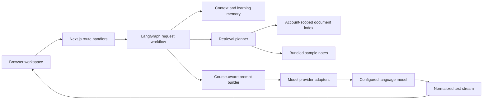
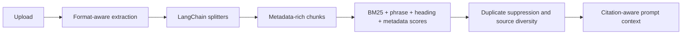

# Architecture

Physics Learning Agent is a single Next.js application with a client learning workspace, server-side model routing, a LangGraph request workflow, and a local persistence layer for small private deployments.

## Runtime topology



The application deliberately keeps orchestration and model execution separate. LangGraph prepares a typed request; provider adapters perform the single generation call and normalize provider-specific streaming formats.

## Request lifecycle

1. The client creates a `conversationId`, `assistantMessageId`, and `requestId` for the generation.
2. The API validates request size and fields, applies a lightweight rate limit, and resolves the signed-in user.
3. The LangGraph workflow classifies intent and language, resolves course/topic context, updates memory, decides whether retrieval is needed, and attaches selected snippets.
4. The prompt builder adds task, course, language, reference-profile, and answer-depth instructions without sending the full knowledge catalog.
5. The provider adapter sends the request to the server default or a user-selected provider.
6. Provider-specific SSE is normalized into a plain text stream plus explicit `done`, `length`, and `error` control events.
7. The client accepts chunks only while all three generation identifiers still match. Switching, creating, or deleting a conversation aborts the active request and stale chunks are ignored.
8. Completed or interrupted content is persisted to the target conversation. Answer feedback is stored on that assistant message, and signed-in workspaces are synchronized to the local account store.

## LangGraph workflow

The graph in `src/agent/workflow.ts` contains six deterministic nodes:

| Node | Responsibility |
| --- | --- |
| `understandInput` | Classify intent, detect response language, and resolve the problem reference style |
| `resolveContext` | Resolve course, topic, query type, knowledge mode, and bounded recent history |
| `updateMemory` | Update structured learning memory for the current conversation |
| `planRetrieval` | Decide whether personal or sample knowledge should be retrieved |
| `retrieveKnowledge` | Retrieve account-scoped and optional bundled snippets |
| `prepareGeneration` | Assemble the final typed request for the prompt and provider layers |

The graph does not create an expensive multi-model chain. It provides explicit state transitions around one primary generation request, which keeps latency and cost predictable.

## Context and memory

Three scopes are kept separate:

- **Recent history:** a bounded set of recent user and assistant turns.
- **Conversation memory:** course, topic, goal, confusions, covered concepts, exercise direction, language, and preferred explanation style.
- **Workspace profile:** lightweight course frequency and recent learning topics used for continuity and recommendations.

Long conversations are summarized into structured memory instead of sending every stored message to the model. Provider API keys are excluded from persistent snapshots.

## Retrieval pipeline



The current local index supports text-based PDF, DOCX, PPTX, XLSX, RTF, OpenDocument, Markdown, LaTeX, and plain text sources. Retrieval preserves available page, slide, sheet, section, course, topic, and language metadata. The scorer can accept a dense-vector score later, allowing migration to PostgreSQL with `pgvector` without replacing the rest of the workflow.

## Persistence model

Anonymous state remains in browser storage. Signed-in state is copied to account-scoped JSON files below `PLA_DATA_DIR`:

- users and hashed session tokens;
- conversation and practice workspace snapshots;
- uploaded source files;
- document metadata and retrieval chunks.

Writes are atomic and in-process read-modify-write operations are serialized by logical resource key. This is suitable for local development and a single Node process. A multi-instance production deployment should replace the JSON stores with a transactional database and shared session/rate-limit infrastructure.

Answer feedback is embedded in the assistant message it evaluates. Practice self-assessment is stored by generated-set ID and problem index. Anonymous users keep both in browser storage; signed-in users reuse the same workspace synchronization path. This keeps the pilot feedback loop inspectable without introducing a second analytics store.

## Provider routing and endpoint policy

The server default uses environment variables. Bring Your Own Key supports OpenAI-compatible providers, Anthropic, and Gemini while keeping temporary keys in browser `sessionStorage`.

Custom OpenAI-compatible URLs are validated on the server. Production requests require HTTPS and reject loopback, private, link-local, metadata, and reserved network addresses, including private addresses returned by DNS. Private model gateways can be enabled explicitly with `PLA_ALLOW_PRIVATE_MODEL_ENDPOINTS=true` in a trusted self-hosted environment.

## Failure handling

- Connection establishment has a server timeout; active streams use a browser idle timeout that resets on each chunk.
- Upstream parse errors do not silently terminate the UI.
- Length limits, transport interruptions, and manual stops preserve partial content and expose continuation/retry actions.
- Workspace synchronization checks HTTP status and retries transient failures.
- Request bodies, upload size, stored history, and prompt context are bounded.

## Verification

```bash
npm run lint
npm run test:run
npm run test:quality
npm run build
npm run test:e2e
```

Unit tests cover classification, prompt construction, memory, generation guards, retrieval, document parsing, persistence, request bounds, endpoint policy, and concurrency. The pilot-quality baseline provides named Chinese and English cases for intent routing, course resolution, and bundled-note retrieval. Playwright covers desktop/mobile conversation isolation, feedback persistence, practice self-assessment, practice rendering, knowledge-base flows, account data, KaTeX, and layout overflow.
