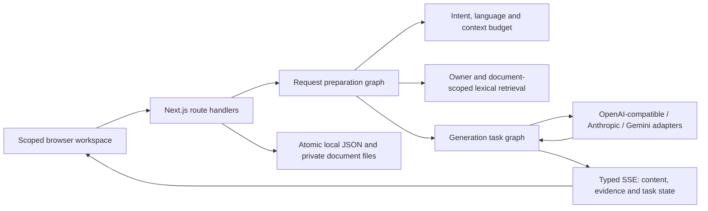
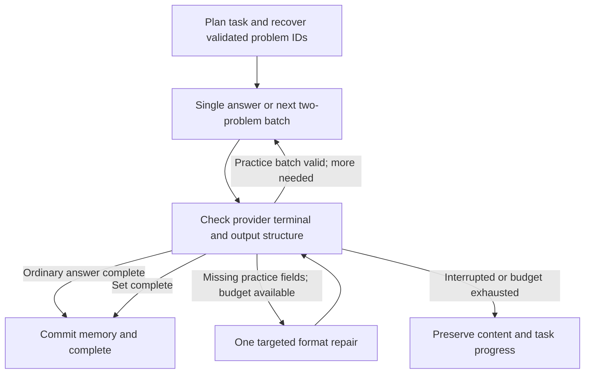

# Architecture

Physics Learning Agent is one Next.js application with a browser learning workspace, account-scoped personal materials, two LangGraph workflows, and provider adapters. The local persistence and admission controls are designed for a single Node.js process in a small private deployment.

## Runtime topology


```mermaid
flowchart LR
  Browser["Scoped browser workspace"] --> API["Next.js route handlers"]
  API --> Prepare["Request preparation graph"]
  Prepare --> Context["Intent, language and context budget"]
  Prepare --> Retrieve["Owner and document-scoped lexical retrieval"]
  Prepare --> Task["Generation task graph"]
  Task --> Provider["OpenAI-compatible / Anthropic / Gemini adapters"]
  Provider --> Task
  Task --> Events["Typed SSE: content, evidence and task state"]
  Events --> Browser
  API --> Store["Atomic local JSON and private document files"]
```

The browser keeps English product navigation and independently selects the answer language from the current request. Chat, Knowledge Map, Practice Problems, Personal Knowledge Base, and API Settings remain the main entry points. General questions use a direct answer with at most a light final note about the physics workspace.

## Request lifecycle

1. The browser captures the workspace owner and authentication epoch, then assigns a conversation ID, assistant-message ID, and request ID. Account changes, session changes, deletion, and unmounting invalidate the active generation.
2. `/api/chat` checks bounded input, rate limits, and the expected workspace owner against the authenticated cookie. Client-supplied owner IDs do not grant access to account data.
3. The preparation graph resolves current intent, language, course, topic, reference style, and retrieval scope. Current explicit instructions outrank historical memory and inherited course context.
4. Personal retrieval admits relevant text within the authenticated user's selected documents or course. The context allocator budgets the current question, selected problem, recent turns, source-tagged memory, and retrieved excerpts once; provider adapters reuse the selected history.
   Owned image references are resolved after this selection and before any provider call. Images are transmitted as native content parts, while only metadata and private IDs enter workspace records and SSE.
5. A generation lease reserves the task's output upper bound and an active slot. Default-key daily pools and all-provider concurrency limits are checked before a model call.
6. The task graph generates one ordinary answer or small practice batches. Deterministic structure checks decide whether to finish, preserve partial work, generate another batch, or use the single practice format-repair allowance.
7. Typed SSE carries model text separately from stages, source excerpts, normalized context, practice progress, committed memory, and the terminal state. Every event has the full generation binding.
8. Completed-answer memory is committed only after successful task completion. Interrupted content and validated practice progress are retained for continuation; they are not recorded as completed knowledge.

## LangGraph workflows

### Request preparation

`src/agent/workflow.ts` contains deterministic nodes for understanding input, resolving context, preparing candidate memory, planning retrieval, retrieving evidence, and preparing generation. Candidate memory helps build this request; it becomes persisted answer memory only after the task succeeds. Cancellation checks surround retrieval and graph execution.

Context provenance records whether a value came from the current input, current selection, history, or a default. A deliberate course switch also removes an incompatible inherited topic. Short follow-ups can inherit the active task, including language, problem style, and requested count.

### Generation task

`src/agent/task-workflow.ts` executes the model task inside a separate graph:


```mermaid
flowchart TD
  Plan["Plan task and recover validated problem IDs"] --> Generate["Single answer or next two-problem batch"]
  Generate --> Validate["Check provider terminal and output structure"]
  Validate -->|Ordinary answer complete| Finish["Commit memory and complete"]
  Validate -->|Practice batch valid; more needed| Generate
  Validate -->|Missing practice fields; budget available| Repair["One targeted format repair"]
  Repair --> Validate
  Validate -->|Set complete| Finish
  Validate -->|Interrupted or budget exhausted| Partial["Preserve content and task progress"]
```

Ordinary questions use one provider call and do not trigger automatic model repair. Practice tasks generate up to two problems per batch, allow at most one format repair across the task, and bound calls by the requested count. Default task limits are 180 seconds and 24,000 output tokens. Provider output caps, reported usage, and conservative charging when usage is absent enforce the output budget. Stopping or losing the connection exposes a partial terminal state rather than implying success.

These checks cover numbering, required fields, completed blocks, and basic markup boundaries. They do not establish correct equations, sufficient physical assumptions, or a correct answer. No symbolic solver, independent physics referee, or unrestricted autonomous-agent loop is present.

## Streaming protocol

OpenAI-compatible, Anthropic, and Gemini SSE are parsed directly into provider events. Completion requires protocol evidence: an OpenAI finish signal or `[DONE]`, Claude's final `message_stop`, or Gemini's appropriate finish reason. Length limits, provider blocking, provider errors, malformed frames, transport EOF, idle timeouts, total deadlines, and cancellation remain distinct from completion. Reasoning and heartbeat activity keep the stream alive without exposing internal reasoning text.

The application sends `text/event-stream` events bound to:

```text
ownerId + authEpoch + sessionId + messageId + requestId
```

Content deltas have sequence numbers; duplicate deltas are ignored and sequence gaps are reported. JSON control events remain separate from generated Markdown, so a model-written control-looking string stays ordinary text. The reader rejects mismatched identities and preserves accepted content after an error. Legacy marker parsing is limited to explicitly declared `text/plain` compatibility responses.

Connection establishment, provider activity idle time, and the task's absolute deadline have separate limits. Raw upstream errors and malformed payloads are not copied into logs or user-facing diagnostics. Stage labels correspond to real workflow nodes and output-structure checks; they do not advertise formula correctness.

## Context, memory and rendering

Recent history, conversation memory, and the workspace learning profile have separate purposes. The allocator prefers the current question and selected problem, then recent turns, a source-tagged summary, and retrieval evidence. It preserves mathematical blocks and relevant conditions when choosing excerpts, marks omitted earlier prose, and removes summary blocks already represented by selected message IDs. Provider adapters add history as conversation messages rather than repeating it inside the user prompt.

Completed assistant explanations appear in summaries with their message IDs and an explicit unverified label. An explanation being present in memory does not mean the student has mastered it or that the explanation has been reviewed.

Streaming display updates are independent of roughly one-second draft checkpoints. Final, stopped, and departing work is flushed to its bound workspace. The Markdown/KaTeX renderer loads on demand and defers streaming work; math normalization respects existing math and code boundaries. GFM tables, local rendering fallback, and horizontal overflow for long formulas remain available. Temporary closure used to display a partial formula does not alter saved content or LaTeX export.

## Private image input

`/api/images` accepts a bounded raw image upload, checks its file signature, then uses Sharp to rotate, remove metadata, resize and encode WebP. It rejects SVG and unsupported formats before decoding. The per-image, per-message, per-request and workspace limits are shared in `image-attachments.ts`; disk quota updates use keyed locks and fresh IDs. The original upload is not retained.

Authenticated images belong to an account. Anonymous images use a random 256-bit credential kept in the anonymous browser scope and an HttpOnly cookie for display. Web Locks coordinate the initial credential across tabs. A guest credential never grants an authenticated account access to that anonymous store. `/api/images/import` is an explicit copy operation used by the import choice; it creates new account IDs without reencoding or deleting the guest originals, and rolls back created copies if a source is unavailable.

`/api/images/[id]` verifies the current owner and serves private, noncached WebP bytes. Filenames are display metadata rather than paths. Account images referenced by saved records cannot be deleted by the unused-upload manager. Application tracing excludes environment files and runtime data; images belong in the persistent data volume, not the standalone build.

The context allocator reserves at most eight unique images, keeping current input and the newest visual history. Earlier omitted images are labeled as unavailable to this request. Adapters deduplicate repeated references and resolve server-owned bytes into OpenAI image URLs, Anthropic base64 image blocks or Gemini inline data. Image bytes, provider keys and guest credentials are excluded from workspace sync and practice recovery parameters.

Practice requests preserve safe image references, the selected model and completed problem IDs. Per-problem follow-up carries source images in the tool context. `.tex` export remains editable text and formulas; source photographs are not embedded. Visual output validation checks structure only, and does not certify image interpretation or physics correctness. There is no native audio/video input, provider file upload, or automatic OCR ingestion pipeline.

### Photographed exam and homework notes

Personal Knowledge Base uses the existing vision generation route to organize photographed questions. The prompt preserves visible numbers, units, diagrams and original language, labels supplied work as unverified, and marks unreadable values without solving the exercise. Recognition drafts use an account-scoped browser key and one-second checkpoints; interruption preserves the accepted text. A manual transcript can also be entered when recognition is unavailable.

`/api/knowledge/problems` accepts only authenticated, explicitly reviewed text with one to four owned source images. It stores a Markdown document through the existing text extraction and indexing pipeline, plus exam/homework category, title, source note and original image references. Identical save payloads share a content-derived capture ID and an account lock, so concurrent retries create one note. This same workspace lock coordinates image deletion with notes and conversation snapshot writes. Images referenced by a saved photo note cannot be removed through the unused-image route.

The authenticated document GET serves the reviewed note with private no-store headers. The library can filter exam or homework photos, show the real source images and recorded source note, and create a `knowledge` tool context in Chat with the reviewed text, images and selected document ID. Reindexing retains photo metadata. Recognition does not populate the index until the user confirms the text; source pixels themselves are not indexed. A checked transcription is not a human physics review.

## Personal retrieval and sources


```mermaid
flowchart LR
  Upload["Private upload"] --> Extract["Format-aware text extraction"]
  Extract --> Split["LangChain splitters"]
  Split --> Chunks["Content hash, version and locator"]
  Chunks --> Scope["Owner, selected documents and optional course"]
  Scope --> Admit["Lexical evidence admission"]
  Admit --> Rank["BM25, phrases, headings and metadata"]
  Rank --> Select["Deduplication and source diversity"]
  Select --> Prompt["Bounded original excerpts"]
```

The local index supports text-based PDF, DOCX, PPTX, XLSX, RTF, OpenDocument, Markdown, LaTeX, and plain text. Upload limits and scan/OCR boundaries are shown in Personal Knowledge Base. Parsing runs within resource and time limits; OCR and a background ingestion worker are not implemented.

Course metadata can improve ranking after relevance admission; it cannot make an unrelated passage qualify on its own. Retrieval status is `disabled`, `unauthenticated`, `no_match`, `retrieved`, or `failed`. No match and retrieval failure can both fall back to an ordinary answer, with different explanations.

Each supplied excerpt has a stable source ID, document ID, content hash, version, and any real locator available from extraction. Answer citations open the original excerpt supplied for that answer. `/api/knowledge/sources/[id]` separately checks current ownership and availability. Removing or reindexing a document can invalidate its live source lookup while the historical excerpt remains in the owner's saved conversation. Deleting a document therefore removes its source file and retrieval index, not already saved answer text or citation snapshots.

The current retriever is lexical with multiple scoring signals and bilingual term handling. Dense-vector scores are an extension interface, not an installed embedding service, vector database, or reranker.

## Practice records

The parser creates structured problem objects with stable IDs, numbering, conditions, problem text, training goals, topic/difficulty metadata, hints, solutions, answers, and optional common mistakes. Validation depends on the requested output mode: questions-only mode must keep solutions absent; full-solution and hidden-answer modes need nonempty solution and answer fields.

Practice progress stores the set ID, target count, output mode, and completed problem IDs. Reload recovery revalidates completed blocks and generates missing problem numbers. Interrupted drafts remain visible without being counted as ready. Original request parameters are saved through a whitelist that excludes provider keys, conversation history, and memory.

Folded hints, solutions, and answers, per-problem follow-up into Chat, and editable `.tex` export use the same record. Self-assessment, attempt drafts, and stuck-step notes follow stable problem IDs; legacy numeric assessment keys remain readable. These records are user observations, not automatic grades.

## Workspace persistence and synchronization

Browser keys are namespaced by anonymous workspace or account ID. Unassigned legacy keys remain untouched. Signing in offers an explicit copy of anonymous or legacy conversations and practice records; no automatic account merge occurs. Import choices are remembered per account. Signing out clears temporary BYOK keys and loads the anonymous workspace while retaining the account's local cache. This cache policy matters on shared devices.

The current conversation is kept per browser tab, with an account-scoped last-used selection for initial restoration. A peer's synchronization refreshes saved content without changing an already selected conversation or clearing its typed draft. Acknowledgement and revision-only storage events do not start another save; actual writer, preference and deletion changes remain eligible for synchronization.

Authentication epochs and cross-tab storage events cancel old generation and sync work. Callbacks verify the owner and epoch again; server routes also validate the expected owner header against authentication. Offline account caches stay on the device and synchronize when the account can be verified again.

Synchronous browser mutations stage writes and publish local events after commit. Storage failures roll back the affected keys and leave the previous revision intact. Per-tab conversation and practice journals preserve concurrent edits when an older full-array write arrives; independent acknowledgement records retain confirmed data, and conditional cleanup cannot erase a newer writer snapshot. Each record permits at most 16 unacknowledged writers. Reaching that limit requires synchronization or an explicit export/removal rather than silently evicting edits. An unreadable journal entry is retained and reported while other records remain accessible.

Account snapshots under `PLA_DATA_DIR` use atomic writes, keyed locks, revisions, operation IDs, and deletion tombstones. A stale revision returns 409 with the current account snapshot. Three-way rebasing combines independent additions and feedback; divergent text is preserved in deterministic conflict copies. A new request can replace an older longer answer, while stale replay cannot restore the old main version. The server retains omitted entities and messages unless an explicit session or practice tombstone removes them.

Deletion markers also prevent cleared feedback and problem assessments from returning. Normal conversation and practice history is not silently trimmed: explicit limits are 80 conversations, 80 sets, and 240 messages per conversation. Quota and browser-storage failures are visible. Generation diagnostics retain at most 100 distinct attempts per message; old operational diagnostics can therefore fall outside an exported report. API Settings exposes conflict details and a private workspace export.

Save state is visible as `Saved`, `Saving`, `Offline`, `Sync failed`, or `Local only`. Debounced synchronization and visibility-change saving supplement local checkpoints. Successful storage and synchronization should be verified before treating a workspace as backed up.

## Admission controls and deployment boundary

The default limits are two active generations per user and eight globally, including BYOK. Server-default output pools are 100,000 tokens per user and 500,000 globally per UTC day. Each task reserves its upper bound before generation; reported usage settles it, while missing usage keeps the reservation spent. `PLA_GENERATION_ENABLED=false` rejects new generation requests. Limits are configured with the `PLA_GENERATION_*` variables described in [Pilot Deployment](pilot-deployment.md).

Locks, rate limits, concurrency counts, and daily pools belong to one process. Restarting the process resets admission counters; multiple replicas would each have separate counters and unsafe shared-file coordination. Provider spending controls and a transactional shared store are required before expanding that deployment model.

The server default reads keys from environment variables. Temporary BYOK values stay in browser session storage and are sent only for the chosen provider request. Personal excerpts are sent to that provider when retrieval is used. Custom compatible endpoints retain server URL/DNS restrictions; trusted private endpoints require explicit configuration. Dependency and parser compatibility decisions, including the remaining development-only exception, are recorded in [Dependency Review](dependency-audit.md).

## Quality evidence

Generation diagnostics record request identity, safe provider/model/task labels, terminal reason, available timings, output size, and reported token usage. They exclude full prompts, replies, document bodies, and raw provider errors. Answer feedback and practice assessment remain in the workspace; collection and export are explicit.

[Pilot Evaluation](pilot-evaluation.md) explains the offline fixtures, mocked protocol/browser checks, retained-record aggregate report, and separate live-model/human review. Recruiting students, conducting physics review, testing paid providers, and observing a deployed pilot remain outstanding activities.

```bash
npm run lint
npm run test:run
npm run test:quality
npm run build
npm run test:e2e
```

Current local evidence and remaining checks belong in [Implementation Progress](improvement-progress.md). Passing deterministic tests confirms the exercised software behavior, not physics-answer correctness or learning improvement.
