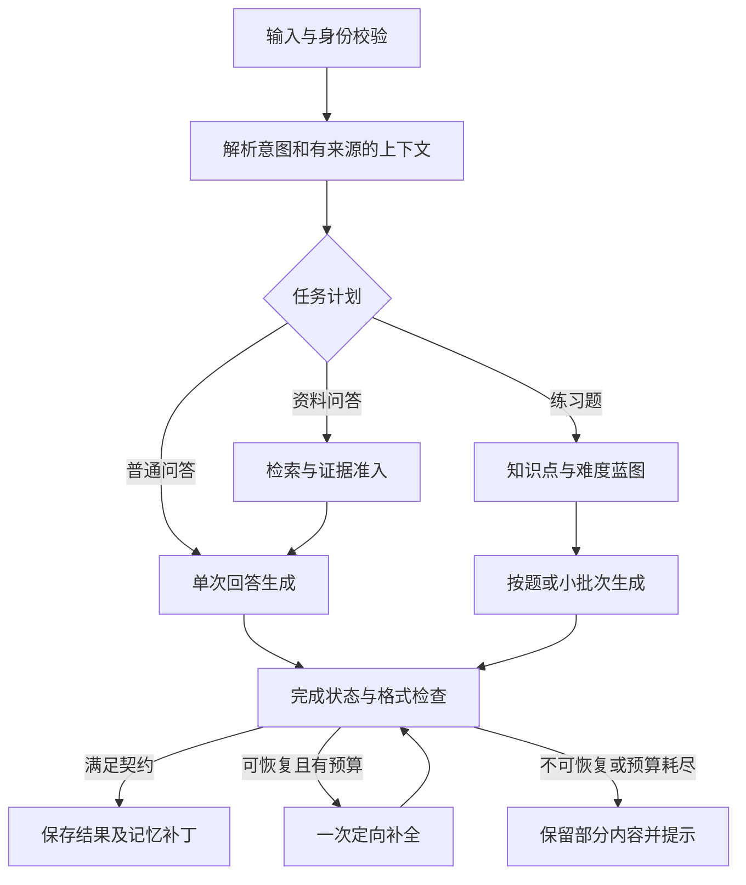

# Physics Learning Agent：系统评估与改进方案

| 项目 | 内容 |
| --- | --- |
| 评估日期 | 2026-09-13；文档完成于 2026-09-14 |
| 代码基线 | 本地 `main`，提交 `489b001` |
| 文档性质 | 基于代码审查和本地测试的改进方案，不是上线验收结论 |
| 适用阶段 | 从个人演示转向受控用户试测 |
| 产品范围 | Chat、Practice Problems、Knowledge Map、Personal Knowledge Base、API Settings |
| 本轮边界 | 不修改业务实现，不升级依赖，不推送、不部署；不访问真实用户私有资料，不调用付费模型 |

## 1. 结论

项目已经有完整的学习工作流，不需要推倒重写。对话、原创练习、题目追问、个人文档检索、多模型接入、账号和本地数据同步都已有实现；LangGraph、LangChain 也不是仅写在 README 中。

但当前不宜直接扩大公开测试。最需要解决的不是增加模型或菜单，而是三个基础问题：

1. **数据可信**：账号切换、跨设备同步和删除记录的行为必须正确。
2. **结果可信**：不能把中断当作完成，不能把无关资料当作检索证据，不能把合法公式显示成源码。
3. **价值可验证**：证明用户能更准确地理解概念、完成练习，而不只是获得更长、更像教材的回答。

建议顺序：**发布风险处理 → 输出与上下文可靠性 → RAG 与练习质量 → 受控试测**。暂不恢复板块复习、题型梳理独立页面，不引入支付、社交、复杂管理后台或无界多 Agent 系统。

### 1.1 已有基础应保留

| 已有能力 | 实际价值 | 当前边界 |
| --- | --- | --- |
| 生成请求绑定会话、消息和请求 ID | 避免新建、删除、切换会话时串流 | 不能替代账号切换时的数据隔离 |
| 按题折叠、隐藏答案、带题目上下文追问、`.tex` 导出 | 支持先练习再看解答 | 仍依赖模型遵守 Markdown 标签协议 |
| 英文界面、中英文回答、教材风格配置 | 适合不同语言的课程学习 | 默认记忆与显式语言切换存在优先级问题 |
| 六门课程、约 95 个静态知识点条目 | 提供可浏览的学习入口 | 数量不等于覆盖完整，也不等于内容已被学科专家审定 |
| 个人文件解析、元数据、词法检索 | 能围绕自己的学习材料提问 | 不是已上线的向量检索或 OCR 系统 |
| 测试、CI、Docker、持久卷及试测部署文档 | 有继续工程化的基础 | 目前仍是单实例、本地文件存储设计 |

### 1.2 当前竞争力与待证明部分

值得继续投入的差异化，是“自己的资料 → 有来源的解释 → 同知识点原创练习 → 针对某题追问”的连续流程。多模型选择、会话列表和 Markdown 本身不是长期竞争壁垒；引入 LangGraph 也不会自动提升物理正确率。

未来应积累三类资产：可复用的物理题目质量标准、带人工标注的检索评测集、经过用户验证的学习流程。目前不能依据 prompt、测试通过率或框架使用情况宣称回答质量稳定优于直接使用 DeepSeek。

## 2. 分析依据与测试结果

检查了页面、会话状态、同步、账号、API、三个模型协议适配、Agent、prompt、记忆、文档解析、检索、练习解析、公式渲染、部署配置和 README。另参考了官方工作流、持久化、界面规范及依赖安全公告，来源见文末。

### 2.1 本轮执行结果

| 检查 | 结果 | 说明 |
| --- | --- | --- |
| `npm run lint` | 通过 | 未发现 ESLint 错误 |
| `npm run test:run` | 31 个测试文件、121 项测试通过 | 既有单元及模块测试 |
| `npm run build` | 通过 | Next.js 16.2.11，编译、TypeScript 检查和静态生成完成 |
| 现有 Playwright 套件 | 24 项通过 | 桌面 Chromium 和移动 Chromium；独立端口、独立测试数据目录 |
| 定向边界诊断 | 10 个案例成功复现当前缺陷 | 这是“确认缺陷存在”，不是“缺陷已经修好” |
| `npm audit --omit=dev --json` | 8 个生产依赖条目存在告警 | 1 critical、6 high、1 moderate；并非 8 条已证实可利用的攻击路径 |
| 完整 `npm audit --json` | 13 个依赖条目存在告警 | 1 critical、9 high、3 moderate，包含开发依赖 |

浏览器测试覆盖会话隔离、删除、快速切换、公式基本显示、答案折叠、题目追问、反馈保存、文档上传和重建索引等。模型回答在浏览器套件中使用模拟响应；账号与文档 API 使用隔离测试账号。没有把测试记录写入项目默认的 `.pla-data`。

**本轮没有验证**：真实模型答题准确率、真实供应商可用性、真实扫描教材解析效果、生产并发、跨地域延迟、实际 iOS 键盘、云端备份恢复、GitHub 当前部署状态。不得将上述本地测试外推为这些能力已达标。

### 2.2 为什么现有测试通过，仍然存在严重问题

- 同步测试验证了“本地和远端能够合并”，没有验证“前后属于不同账号时不能合并”。
- 模型模拟主要从 `/api/chat` 的浏览器返回值开始，绕过了 Anthropic、Gemini 上游转换器。
- 公式测试验证了裸 `\tag{}` 的修补，却没有测试已经处于块级公式中的 `\tag{}`。
- RAG 的基础样本集中于应命中的查询，没有充分覆盖不应命中的查询。
- 当前质量基线含 18 个意图样例、12 个课程样例、6 个内置资料检索样例，不是对最终物理答案的评测。

## 3. 主要问题与优先级

优先级定义：P0 为外部试测前必须处理；P1 为下一轮可靠性和学习质量的必要改造；P2 为基本质量稳定后的体验、效率和扩展工作。

“模块复现”表示使用项目真实函数和合成输入复现；“代码确认”表示控制流或配置可直接确认；“待实测”表示不能仅凭代码判断实际影响程度。

| 编号 | 优先级 | 发现 | 证据状态 | 直接影响 |
| --- | --- | --- | --- | --- |
| F01 | P0 | 未按账号区分浏览器工作区，登录时自动合并 | 模块复现＋退出流程确认 | 共享浏览器可将 A 的记录写进 B 的账号 |
| F02 | P0 | 当前依赖树有严重安全公告，含 Next.js | 审计＋公告核对 | 不适合直接暴露受影响服务；须核对具体部署条件 |
| F03 | P1 | 旧快照可恢复已删会话；80 条远端记录被客户端裁成 60 条 | 两项模块复现 | 删除语义失效、历史静默减少 |
| F04 | P1 | Anthropic、Gemini 在意外 EOF 时补造完成信号 | 两项适配器复现 | 部分长回答可能被正常完成状态掩盖 |
| F05 | P1 | 默认英文参考体系覆盖中文输入；旧课程覆盖明确切换 | 两项工作流复现 | 语言、教材体系和学习任务不一致 |
| F06 | P1 | 仅课程元数据加分也能检索到完全无关片段 | 模块复现 | RAG 可能降低可信度而不是提升可信度 |
| F07 | P1 | 已有数学分隔符的 `\tag{}` 被再次包裹；Markdown 表格未启用 GFM | 两项渲染复现 | 合法公式裸露、表格变成文本 |
| F08 | P1 | 记忆偏向问题摘录，多层截断且重复发送历史 | 代码确认 | 长推导中的条件、结论及符号难以保留 |
| F09 | P1 | LangGraph 在生成前结束，缺少输出校验及任务恢复闭环 | 代码确认 | 有流程结构，但不能可靠确认任务是否完成 |
| F10 | P1 | 中文输入法回车未检查组合输入状态 | 代码确认，需输入法实机复核 | 选词确认可能被当作发送 |
| F11 | P2 | 每次流式更新同步读写整份会话；大组件职责集中 | 代码确认，性能程度待测 | 历史越多，主线程与维护成本越高 |
| F12 | P2 | 反馈已可保存，但没有可分析的任务级质量闭环 | 代码确认 | 无法判断哪些优化真正帮助用户学习 |

### 3.1 F01：账号数据隔离必须先于功能扩展

`UserDataSync` 登录后读取远端数据，再调用 `applyClientUserDataSnapshot` 与全局 localStorage 合并，然后自动回传。退出仅清理登录和文件列表状态，没有隔离或清理工作区。

复现：浏览器已有 A 的一条记录，应用 B 的空工作区快照后，再收集本地快照，A 的记录仍然存在。结合登录后的自动 PUT，这构成明确的数据混合路径。本轮没有测试或声称已经发生远端入侵。

证据：[登录与同步流程](../src/components/layout/UserDataSync.tsx#L102)、[客户端合并](../src/lib/user-data-client.ts#L111)、[退出流程](../src/app/knowledge-base/page.tsx#L153)。

改造要求：

1. 区分匿名工作区与账号工作区，例如 `pla.workspace.guest`、`pla.workspace.{userId}`；所有缓存、偏好、练习记录一并归属。
2. 增加账号会话版本 `authEpoch`。登录、退出或切换账号时，取消旧同步和生成请求；回调同时校验账号及 epoch。
3. 匿名记录导入必须经用户选择，不得默认把“上一个登录账号的记录”当作匿名记录导入。
4. 退出后清除内存中的账号数据和临时 BYOK 密钥，加载独立匿名工作区；是否保留账号离线缓存需明确策略。
5. 后端以认证身份确定 owner，不接受客户端声称的 userId 作为权限依据。现有服务端按用户取文件的做法保留。

验收：A 登录、退出、B 登录；A 的延迟 GET/PUT 到达 B 界面；同浏览器多标签切换身份；退出时仍有流式输出。B 的界面、本地快照和服务器数据均不得出现 A 的记录。

### 3.2 F02：依赖风险需要当前证据，不能沿用旧审计结论

项目固定 `next@16.2.11`，并覆盖为 `sharp@0.35.3`。当前公告将受影响的 Next.js 16.x 修复下界列为 16.3.3，分别涉及 Windows 托管条件和 AVIF 图片优化路径；不能把本地构建通过作为安全依据。[Windows 公告](https://github.com/advisories/GHSA-p293-qw3h-jr36)、[AVIF 公告](https://github.com/advisories/GHSA-2xp9-vwfh-vxw4)

`officeparser` 的 PDF/XML 依赖链也有告警。PDF.js 该公告包含 `enableScripting` 等前提，不能直接断言项目的服务端文本抽取已满足利用条件，应核对调用方式。[PDF.js 公告](https://github.com/advisories/GHSA-hq66-cqwq-w95j)

实施顺序：更新 Next.js 与匹配的 ESLint 配置；重新检查 sharp/postcss overrides；评估解析器兼容升级；重跑安装、构建、原生二进制及文档解析测试。不要直接执行 `npm audit fix --force`，审计给出的自动修复可能包含解析器大版本回退。

上线门槛：可达的 critical/high 告警修复；无法立即修复的条目必须记录影响条件、临时隔离措施、责任人和到期时间。试测前轮换曾在聊天、日志或公开渠道出现过的密钥，后续不通过聊天传递密钥。

### 3.3 F03：同步应保存用户操作，而不是互相覆盖的快照

现有合并没有删除墓碑。删除后的会话仍能从旧设备快照回到本地；服务端最多保存 80 条会话，而客户端 `saveStoredSessions` 只保留 60 条，远端恢复后再自动同步可能把截短结果覆盖回去。

证据：[合并策略](../src/lib/user-data-client.ts#L97)、[客户端数量限制](../src/lib/storage.ts#L198)、[服务端数量限制](../src/lib/user-data-server.ts#L64)、[整份替换保存](../src/lib/user-data-server.ts#L493)。

短期不必立即换数据库，也可以先增加 `revision`、`deletedAt`、`operationId` 和条件更新。冲突返回 409，不能静默丢弃另一台设备的改动；删除操作需要保留墓碑直到旧副本不再重放。

数据数量上限应统一，并改为分页、归档或明确配额，而不是静默裁切。界面增加 `Saved / Saving / Offline / Sync failed` 状态。关闭页面的 beacon 只能是补充，不应承担唯一的最终保存保障。

### 3.4 F04：完成信号必须来自模型协议，不能从连接结束推断

Anthropic 与 Gemini 适配器的 `flush` 都无条件写入 `[DONE]`。模拟上游仅发送一段正文后结束，两个适配器最终都产生应用层 `done`，没有中断信号。Anthropic 的部分 error 事件也被转换为空事件而非错误。

证据：[Anthropic 适配器](../src/lib/deepseek.ts#L280)、[Gemini 适配器](../src/lib/deepseek.ts#L354)、[前端读取器](../src/lib/read-agent-stream.ts#L1)。这说明当前代码存在可导致“未完成但无提示”的路径，不代表已经证明历史上每次中断都由它引起。

将统一协议从正文夹带标记改为有类型的 SSE 事件：

```ts
type GenerationEvent =
  | { type: 'delta'; requestId: string; messageId: string; seq: number; text: string }
  | { type: 'stage'; requestId: string; stage: string }
  | { type: 'sources'; requestId: string; sources: SourceReference[] }
  | { type: 'complete'; requestId: string; finishReason: string; usage?: TokenUsage }
  | { type: 'interrupted'; requestId: string; reason: string; retryable: boolean };
```

以上为目标契约示意，类型并未在本轮加入代码。正文与控制事件分开后，模型输出看起来像内部标记的文本也不会触发状态变更。

统一映射正常结束、长度限制、供应商拦截、错误、用户取消、无终止信号 EOF；任何无终止证据的 EOF 都不能当作正常完成。解析坏事件时保留正文并记录脱敏诊断；即使后续流继续，也要告知可能存在数据缺失。

保留现有 `sessionId + assistantMessageId + requestId` 防护，扩大到账号维度。连接超时、上游活动空闲超时、总预算分别管理；推理活动不能直接等同于可显示的回答，也不应被误判成完全无响应。取消信号应传入检索与解析阶段，而不只作用于模型 fetch。

### 3.5 F05：显式意图、自动推断、历史记忆必须区分

初始化记忆把 `referenceProfile` 设为 `english`；后续解析优先采用该历史值。实测中文首问虽然识别为 `zh`，参考体系仍为 `english`。另一个案例中，已有数学物理课程和 Green 函数上下文时，明确要求切换量子力学，工作流仍保留原课程和知识点。

证据：[默认记忆](../src/agent/memory-manager.ts#L35)、[参考体系解析](../src/data/referenceProfiles.ts#L43)、[工作流上下文解析](../src/agent/workflow.ts#L77)。

建议统一为带来源的上下文：

```text
字段值 + 来源（本轮显式输入 / 本轮表单选择 / 历史推断）+ 更新时间
```

本轮明确要求优先于旧记忆；本轮表单和文字发生冲突时提示并允许确认；简短追问且无新约束时才继承历史。`auto` 是待推断状态，不能等同于英文显式锁定。课程改变时校验知识点是否仍属于该课程。

此外，`exercise-parser` 只识别 3/5/10 数量；`final exam` 无条件映射中文期末风格；`mit` 使用无词边界匹配。应补充自然语言数量、语言与考试风格组合、否定表达、短词误命中测试，而不是继续零散增加关键词。

验收至少包括：中文第一问、英文切中文、中文考研后“再来两道”、英文 final exam、出现 `limit` 的普通数学问题、从知识点导览进入后显式换课、非物理插问后回到原题。

### 3.6 F06：RAG 必须能够可靠地回答“没有相关资料”

当前分数直接相加后用很低阈值过滤。复现时，即使正文与查询没有词法匹配，仅课程相同也返回片段。课程标签可以排序，不能单独作为相关证据。

证据：[元数据评分](../src/rag/search.ts#L46)、[总分及过滤](../src/rag/search.ts#L225)。

先加入相关性准入，再做课程加权和多样性选择。返回明确状态：`disabled / unauthenticated / no_match / retrieved / failed`。无匹配不是故障；检索故障也不能伪装成没有资料。两者均可继续普通回答，但应准确说明是否参考了个人资料。

### 3.7 F07：公式问题不应继续依赖全局正则修补

以下本来合法的内容会被重复插入分隔符：

```latex
$$
E=mc^2 \tag{1}
$$
```

实际服务端渲染结果包含两个空数学块，中间正文为 `<p>E=mc^2 \tag{1}</p>`。另外，虽然声明了 `table` 渲染组件，`remarkPlugins` 只有 `remarkMath`，管道表格未被解析成 HTML 表格。

证据：[数学文本规范化](../src/components/common/MarkdownRenderer.tsx#L86)、[Markdown 插件](../src/components/common/MarkdownRenderer.tsx#L223)。

应使用数学／代码边界感知的扫描或语法树转换：已处于数学环境的内容不再包裹；正常代码块不改写；只有明确识别的裸数学环境才修补。补入 GFM 支持并测试表格、链接和公式的交互。

保留错误边界、KaTeX 非抛错模式和长公式横向滚动。不得因异常公式直接丢弃后续正文；用于流式显示的临时闭合不能写回保存内容或导出的 `.tex` 文件。

当前代码和浏览器测试没有支持“全站结果区被固定高度普遍裁掉”的结论。聊天主区已有固定高度 flex 和内部滚动，知识目录中的 `line-clamp` 只用于摘要。不要通过扩大画布或取消所有 overflow 来掩盖协议、解析问题。

## 4. Agent 与记忆的目标架构

### 4.1 现状与目标

当前 LangGraph 的六个节点依次完成理解输入、解析上下文、更新记忆、计划检索、执行检索、准备生成。图结束后，API 才调用模型；没有在图内对输出完整性进行判定、修复或提交最终记忆。

这属于有效的显式 workflow，不应被否定；但也不应描述为已具备自主多步骤验证的 Agent。官方同样区分预定义 workflow 与动态 agent。建议只为确有需求的学习任务引入有界分支，不为展示框架而增加调用。[LangGraph workflows and agents](https://docs.langchain.com/oss/javascript/langgraph/workflows-agents)



建议初始预算：普通问答一次生成；校验先用确定性程序；仅结构缺失或明确可修复错误才追加一次模型补全。复杂任务有总时长、总 token、最大重试次数，不能形成无限循环。

### 4.2 短期上下文与长期记忆分开

当前 `buildConversationSummary` 主要摘录最近四条用户问题，没有持续保存教师已解释的公式与结论。历史又在 API、context manager、provider 层多次截断，并在 prompt 中重复出现。应改成单一预算分配器。

| 记忆层 | 应保存什么 | 不应保存什么 |
| --- | --- | --- |
| 当前任务 | 原问题、课程／topic ID、语言、风格、当前题号、约束、未完成步骤 | API key、模型内部推理文本 |
| 对话摘要 | 学生困惑、已说明的条件与结论、符号定义、待回答问题，附消息 ID | 只列问题标题，或把模型错误当作已确认事实 |
| 学习偏好 | 用户明确选择的深度、语言和解释偏好 | 从偶然问题推断敏感身份信息 |
| 学习状态 | 用户自评与实际练习尝试，标明证据来源 | 把“问过／讲过”直接等同于“掌握了” |

预算顺序建议为：本轮问题及约束 → 正在追问的题目／公式 → 最近完整轮次 → 有来源摘要 → 检索证据。知识库、历史消息与摘要不得重复大段注入。裁切应遵循消息与数学块边界，而不是随意截去单条答案末尾。

生成确认结束后再保存记忆补丁；中断时只记录任务进度，不把未完成结论写成知识事实。客户端消费同一份服务端规范化上下文，避免两端独立推断后产生不同记忆。

持久化时可利用 LangGraph checkpointer，但必须把会话 thread 与账号绑定；checkpoint 不是账号权限层，也不能单独解决跨设备同步。[LangGraph persistence](https://docs.langchain.com/oss/javascript/langgraph/persistence)

### 4.3 状态应可追踪，但不展示虚假的检查过程

`GenerationStatus` 当前每 2.6 秒轮换“检查公式”等文案，并非真实验证事件。短期改成诚实的 `Generating…` 和已生成题数；工作流确实增加校验节点后，再显示真实阶段。

每个请求记录脱敏的 request ID、模型、意图、知识库模式、各阶段耗时、首个正文时间、finish reason、token 用量和错误分类。不默认记录原始问题、完整资料或密钥。恢复后创建新的 request ID，但保持所属账号、会话、答案与题目身份。

## 5. RAG 改进路线

### 5.1 先建立可核查的资料问答

当前有格式解析、中文分词、BM25、标题／短语加权、元数据和去重，值得保留。尚未实际接入 embedding；`vectorScores` 是预留接口，不是已经存在的语义向量检索。

第一阶段完成：

1. 上传前显示格式限制、12 MB 上限和扫描件边界；文件状态区分已存储、待索引、索引中、可检索和失败。
2. 保留原文件名作为显示字段，用不可猜测存储 ID 管理文件；提供安全的内容预览。
3. 给文档和 chunk 加内容哈希、版本、切分器版本、语言、章节路径和真实来源定位。
4. 检索返回稳定 source ID；点击引用能看到本轮使用的原片段，不能只显示模型写出的文档名。
5. 支持用户限制到某份笔记或当前课程，默认不把所有库内容混用。
6. 明确上传材料将按需要发送到用户选择的模型供应商；切换供应商不能绕过这一告知。

### 5.2 再提高检索质量

用一个固定基准对比：现有词法检索 → 词法检索加中英文术语扩展 → 双语向量与词法融合 → reranker。不要未经评测就把全部阶段串上去。

建议候选范围先取 20–40 个，再选 3–6 个证据片段；这些是待基准校准的起始参数，不是通用最优值。上下文片段同时受 token 上限、相关性和文档多样性约束。

物理材料应把定义、适用条件、公式和紧邻说明尽量保存在同一语义单元。习题题干与条件不能只因长度切到不同片段；长证明用父子块定位。中文问英文资料和英文问中文资料需单独评测，不能用同语言命中率替代。

### 5.3 解析与存储边界

现有 officeparser 已关闭 OCR、限制解压体积和 ZIP 条目，并提供解析超时；不是完全没有保护。但复杂解析仍运行在服务进程内，上传请求同时承担存储和索引。文件、文档元数据、chunk 三者也没有跨文件事务。

受控测试可先限制并发和总容量；扩大前将解析转入可终止的 worker，增加幂等任务、失败重试、孤立文件清理和文档删除后的索引失效。只有拿到真实扫描件需求和质量基准后再选择 OCR，尤其要单独检查公式识别。

单机阶段先缓存倒排统计并按文档版本失效，避免每次检索都扫描全部 chunk 重算词频。多实例阶段再迁移 PostgreSQL、对象存储和队列；向量扩展与部署平台选择分开决策。

## 6. 练习题与知识体系

### 6.1 练习题从展示格式升级为教学数据

当前按 `### Problem n` 和粗体标签解析字段，适合 MVP，但缺少稳定题目 ID、字段完整性、题数校验和版本控制。字段格式变化后可能把解析显示到题干区，编号变化也不应使“已完成”状态落到另一道题上。

目标对象建议包含：题目 ID、知识点 ID、训练目标、题型、难度、完整条件、题干、提示、解析、答案、易错点、生成版本、验证状态。正文仍保存 Markdown，公式仍用 LaTeX；无需重写现有题目卡片。

生成 10 道题时先确定覆盖蓝图，再小批生成。每题完成并通过字段校验后保存，进度显示 `3 of 10 problems ready`。续写依据已完成题目 ID 和缺失字段，而不是让模型猜“刚才写到哪里”。

格式合格不等于物理正确。确定性检查只能覆盖编号、字段、符号表、公式能否渲染等；答案正确性与条件充分性需学科审核，少数适合数值／符号校验的题型再逐步接工具。

### 6.2 增加少量高价值的练习反馈

保留先题干、后提示、再解析的顺序。在现有 `Solved / Needs work` 之上，可先增加可选作答草稿和“卡在哪一步”，不急于做自动打分。

下一组练习利用用户明确的困惑和尝试记录，调整条件或求解目标，而不只是把数字换一下。自评只作为弱信号，不能对外宣称产品已经准确测量知识掌握度。

### 6.3 知识点应可维护，不是继续堆文本

将 95 个条目按“课程 → 章节 → 概念／方法 → 典型任务”组织，前置和关联关系统一用 ID，显示名称独立维护。当前关联使用标题字符串，改名容易导致隐式关系断开。

保留英文产品界面，中文别名用于搜索和问题识别。不要依赖过滤汉字来保证英文界面，应明确 `display.en`、`aliases.zh` 等字段职责。

每条常用公式补充变量含义、约定和适用条件，例如维度、边界、粒子统计或近似范围。安排学科审读清单、内容版本和最后核查记录；参考教材风格不能替代教材实际来源，也不能伪造题号和页码。

## 7. 前端体验与性能

### 7.1 保留稳定布局，修复边界交互

- 聊天保持固定高度 flex、内部消息滚动、底部输入框占位。不得为解决渲染失败而改成全页滚动。
- 中文输入法的 Enter 增加 composition 状态保护；同时验证 Shift+Enter 和移动端发送。
- 输入框增加独立可访问名称，不能只依赖 placeholder；移动 Sidebar 加 Escape、焦点约束和关闭后焦点恢复。
- 补测 360、390、768、1024、1280 宽度、横屏和缩短可视高度。Chromium 手机模拟不代表 iOS 实机键盘通过。
- 同步失败、知识库未命中、解析失败、长度截断分别展示，不统一归为“请求失败”。

这些检查采用语义控件、可见焦点和异步状态可感知原则，不要求增加装饰性 UI。[Web Interface Guidelines](https://raw.githubusercontent.com/vercel-labs/web-interface-guidelines/main/command.md)

### 7.2 将流式渲染和持久化频率分开

当前聊天约每 64 ms 更新一次正文，同时读取、序列化并写回全量会话。MarkdownRenderer 也在流式阶段处理完整累积内容。已有 memo 和节流，不宜宣称“完全没有性能优化”；应针对仍然昂贵的工作测量和拆分。

建议：正文保持 50–100 ms 合并；增量在内存累积；草稿按较低频率保存，结束、停止和离开时提交最终快照；进一步迁移 IndexedDB 或实体级服务端更新。必须保留崩溃恢复能力，不能简单取消中途保存。

Markdown／KaTeX 按需加载；长内容可按稳定块缓存，当前未闭合块轻量显示。不要先虚拟化所有消息，公式高度与目录定位会增加复杂性；只有性能测量证明有必要时再引入。

### 7.3 按职责拆分，不按“代码行数”盲拆

当前 `ChatWorkspace.tsx` 约 1104 行、`AgentGenerator.tsx` 约 889 行。建议抽离共享生成生命周期、会话仓储、续写任务和格式校验，UI 仅消费状态；三个模型协议分别有适配器。先写契约测试，再逐块替换，保持现有路由和数据兼容。

## 8. 上线、数据与运营边界

### 8.1 两条部署路径，不混用假设

| 路径 | 适合阶段 | 前提 |
| --- | --- | --- |
| 单台 Linux 主机、Docker、持久卷、HTTPS | P0/P1 修复后的邀请制小范围测试 | 单副本、资源上限、备份恢复验证、关闭非必要公开入口 |
| Vercel 承载 Web/API，外接持久存储与解析 worker | 国际用户和弹性扩展 | 先替换本地账号／工作区／文档文件存储，确认上传、函数期限和队列方案 |

不要把 `.pla-data` 或仅修改 `PLA_DATA_DIR` 当作无状态多实例部署方案。Vercel 的函数与上传限制随运行配置而异，实施前按选定套餐核对，不能照抄本地 12 MB 上传和长连接假设。[Vercel Functions limitations](https://vercel.com/docs/functions/limitations)

在受控测试阶段，先完成迁移接口而非立即同时建设数据库、Redis、向量库和完整后台。扩大用户规模前需验证跨用户隔离、数据库约束、对象权限、后台任务幂等、删除流程和恢复操作。

### 8.2 上线前的最低控制

1. 分离开发、测试、生产数据与密钥，测试使用独立存储和 mock provider。
2. 生成接口除请求频率外，还要有并发与日成本上限；多个账号不能无限消耗公共默认 key。
3. 自定义模型 endpoint 保留现有地址校验，并补测重定向和 DNS 地址变化；未验证前可在公开试测关闭自定义 URL。
4. 日志禁止密钥和完整上游原文；错误信息先脱敏。原始文档和账号备份加访问控制与保留期限。
5. 定义导出、账号退出、删除会话、删除文档、删除账号分别删除什么；备份中的删除延迟需说明。
6. 保持上传权利声明；模型生成题目不得声称来自指定教材原题或官方课程。
7. 校验镜像、持久卷、备份恢复和回滚，而非只测试健康检查返回 200。

上述为工程与产品要求，不构成特定司法辖区的法律合规结论；公开运营前再进行针对目标地区的隐私与条款审查。

## 9. 评测与小范围试测

### 9.1 先补自动化评测

| 测试层 | 必补用例 | 验收重点 |
| --- | --- | --- |
| 数据同步 | A/B 账号切换、延迟返回、多标签、两设备冲突、删除重放、超过 60 条历史、容量不足 | 不串账号、不丢记录、删除不复活 |
| 模型协议 | 三种协议的正常结束、截断、error、半截事件、无终止 EOF、推理空闲、取消 | 正文不丢，状态真实，事件序列不重复 |
| 会话隔离 | 新建／切换／删除／退出账号时生成和续写仍在返回 | 旧请求不得写入新目标 |
| 语言意图 | 双语首问、切换语言、显式换课、歧义术语、数量续问、非物理插问 | 用户本轮目标优先，普通问题不被物理化 |
| 渲染 | 已闭合数学块内 tag、代码中的分隔符、对齐环境、GFM 表格、坏公式后的文字 | 合法输入稳定，错误局部降级，无正文丢失 |
| 练习题 | 3/5/10 题、不同输出模式、重复编号、缺失答案、最后一题未完成、续写后刷新 | 内容与学习状态按题目 ID 对齐 |
| RAG | 无相关资料、同课程无关资料、中英跨语言、相近概念、用户隔离、删除与重建 | 命中可信，无证据时明确不引用 |
| 端到端 | 生产构建、长文本、键盘、窄屏、错误恢复 | 不只检查“页面存在”或“出现一个 KaTeX 节点” |

CI 继续保留现有 lint、单测、构建和容器冒烟；增加协议适配测试、数据同步回归、安全审计和失败截图归档。将每个真实缺陷转为回归案例，不能通过删掉失败断言来恢复绿灯。

### 9.2 RAG 与回答质量基准

第一批建议 120 个查询：六门课程各 20 个，其中直接检索、中英跨语言、多轮指代、无答案、相似概念辨析均有样例。每个查询人工标注可支持结论的片段 ID，而非只标文件名。记录 Recall@k、MRR、无答案误引用率、引用支持率、延迟和单次成本。

再选 40–60 个代表性学习任务，比较三种条件：直接问同一模型、课程上下文工作流、课程上下文加个人 RAG。固定模型版本、输出预算和题目，随机顺序、盲评；评分包括正确性、条件完整性、推导连贯性、引用支持和完成任务所需时间。

至少一名具备相应课程背景的评审人工复核。小样本报告分母、分布和不确定性，不把主观喜欢程度当作学习提升，也不把短期使用频率当作考试成绩提升。

### 9.3 邀请制试测设计

P0 和输出可靠性门槛通过后，邀请 10–20 名目标学生，运行两周。先聚焦两门资料较完整的课程，而不是同时承诺所有课程同等深度。招募时明确英语界面和中文／英文回答能力，确认 BYOK 是否为使用门槛。

任务固定为：完成一次概念追问、上传自有笔记并核对一个引用、完成一个小练习集、针对一题继续追问。记录任务失败点和原因；用户可拒绝内容采集，不影响基本使用。

| 指标 | 定义 | 本轮数据 | 建议验收方式 |
| --- | --- | --- | --- |
| 账号隔离 | 跨账号内容泄漏或误写次数 | 已复现风险，非线上事件统计 | 全部隔离测试零失败 |
| 输出可解释性 | 每个请求都有完成／中断／取消状态 | 无线上基线 | 故障注入用例全部显示真实终态 |
| 练习可用率 | 指定题数、必要字段及可读公式完整的集合／生成集合 | 待采集 | 首批人工审核 30 组，逐组记录错误 |
| 引用支持率 | 被引用片段确实支持结论的引用／抽检引用 | 待采集 | 抽检至少 50 条引用，记录错误类别 |
| 核心任务成功率 | 完成指定学习任务的人数／尝试人数 | 待采集 | 每个任务分别报告，不只报总平均 |
| 性能 | 本地操作响应、TTFT、检索耗时、生成总耗时 | 待分阶段测量 | 按模型／任务分组给 p50、p95 |
| 返回使用 | 七天内再次完成核心任务的已激活用户／可观察满七天用户 | 待采集 | 两周试测只作方向性观察 |
| 成本 | 成功任务所耗 token、解析与存储成本 | 待采集 | 先设预算与上限，再谈免费额度 |

除数据隔离、错误可见性等确定性门槛外，学习和性能指标先获取基线，再定改进阈值。不要在没有测量的情况下填写漂亮的增长百分比。

## 10. 分阶段实施计划

工作量为一名熟悉项目的全栈开发者的粗估工程日，不含服务采购、外部安全复核和学生招募。每阶段结束必须重新评估范围，不承诺固定日期上线。

| 阶段 | 优先工作 | 主要改动位置 | 验收出口 | 估计 |
| --- | --- | --- | --- | --- |
| A：数据与发布底线 | F01/F02；统一数量限制；版本冲突和删除语义；同步状态 | `UserDataSync`、storage、user-data、auth、依赖与 CI | 账号切换／同步回归通过；严重依赖风险已处置 | 5–8 日 |
| B：输出与上下文 | F04/F05/F07/F08/F10；协议统一；记忆优先级；IME | providers、read-agent-stream、workflow、memory、MarkdownRenderer、ChatInput | 三类协议异常矩阵通过；双语和公式边界通过 | 6–10 日 |
| C：学习质量 | RAG 准入和引用、题目对象与小批生成、任务校验、稳定 ID | rag、personal-knowledge、practice-parser、AgentGenerator、workflow | 题目与检索基准可复现；用户能核对证据 | 8–12 日 |
| D：受控试测 | 分组任务、反馈归因、性能采样、成本边界、文档校准 | evaluation、脱敏事件、部署与试测文档 | 输出真实的试测结论和下一轮优先级 | 两周观察窗口 |

最小可行方案不是完成全部远期架构：A+B 结束后，如资料路径的 F06 已修复并通过无匹配测试，可限定资料格式、模型和并发进行邀请制测试；更广泛开放须完成 C 的相关质量门槛。

明确暂缓：微服务拆分、无界自主 Agent、自动执行用户代码、全量扫描教材 OCR、多个向量数据库并行接入、支付与机构后台。遇到真实需求后再扩展，不以技术名词数量衡量成熟度。

## 11. README 与项目介绍的校准

保留现有英文 README 的产品主线、截图、课程表和结构图；不要写成修复日志。代码和 README 的关系应调整为：

| 当前表达方向 | 建议边界 |
| --- | --- |
| account-scoped workspace memory | 服务端文件按账号隔离，但客户端同步问题修复并验收前，不作完整跨账号隔离承诺 |
| robust intent routing | 说明是带规则与上下文的意图路由，不宣称覆盖所有语言和歧义输入 |
| grounded answer | 写明提供检索片段与引用提示；只有引用可检查、质量可评测后再强化该描述 |
| LangGraph-orchestrated workflow | 可以保留；图应明确生成在当前图外，目标架构与现状分开 |
| hybrid retrieval | 当前是多信号词法检索；向量分数接口为预留，不描述成已部署 embedding |
| formula checking | 区分显示格式检查与物理／数学正确性验证 |
| bilingual reference profiles | 保留目标，但需用自动模式、切换语言和考试风格测试支持 |

账号、上传材料、公共默认 key 与临时 BYOK 的数据流应有独立说明。始终使用 General Physics，不重新引入 Physics Education 或已删除模块。现有上线 PRD用于需求管理，本文件用于缺陷证据和工程顺序，两者不互相覆盖。

## 12. 上线后补充区

以下字段刻意留空；必须由真实测试补充，不能用预测替代。

| 轮次 | 用户与环境 | 任务及样本量 | 成功／失败证据 | 优化决定 | 回归结果 |
| --- | --- | --- | --- | --- | --- |
| Pilot 1 | 待填写 | 待填写 | 待填写 | 待填写 | 待填写 |
| Pilot 2 | 待填写 | 待填写 | 待填写 | 待填写 | 待填写 |

| 决策 | 当前状态 | 需要的证据 |
| --- | --- | --- |
| 公共测试还是邀请制 | 建议先邀请制，待确认 | 账号隔离、并发、成本与应急方案 |
| Vercel 还是单机部署 | 未定 | 持久存储方案、目标地区、实际访问表现 |
| 是否优先做 OCR | 未定 | 用户上传中扫描件占比、抽取失败类型 |
| 是否引入 embedding/reranker | 未定 | 当前词法基准的漏检与误检分析 |
| 产品是否优于直接问同一模型 | 未证实 | 同条件盲评与真实任务结果 |

## 13. 外部参考与使用范围

- [LangGraph：Workflows and agents](https://docs.langchain.com/oss/javascript/langgraph/workflows-agents)：用于区分固定流程与动态任务分支，不作为项目已经具备自主性的证据。
- [LangGraph：Persistence](https://docs.langchain.com/oss/javascript/langgraph/persistence)：用于设计任务状态恢复，不替代账号鉴权和业务数据一致性。
- [Web Interface Guidelines](https://raw.githubusercontent.com/vercel-labs/web-interface-guidelines/main/command.md)：用于可访问性、输入、焦点及异步状态检查。
- [Vercel Functions limitations](https://vercel.com/docs/functions/limitations)：部署时应重新按实际配置核对运行边界。
- [Next.js Windows 公告](https://github.com/advisories/GHSA-p293-qw3h-jr36)、[Next.js AVIF 公告](https://github.com/advisories/GHSA-2xp9-vwfh-vxw4)、[PDF.js 公告](https://github.com/advisories/GHSA-hq66-cqwq-w95j)：与本轮审计结果交叉核对，未进行攻击性验证。

最终建议：先把用户已经拥有的数据和已经发起的学习任务可靠地保存、完成和解释，再增加能力。下一轮最值得实施的交付不是“更多 Agent”，而是一个不会串账号、不会假完成、能明确给出资料依据的学习闭环。
