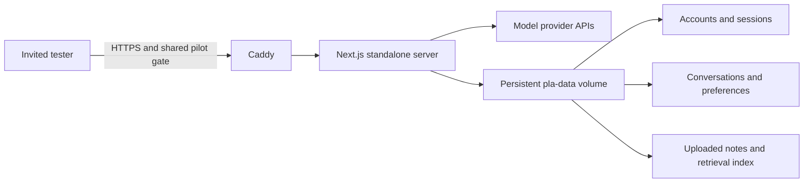

# Pilot Deployment Guide

This guide describes a controlled, single-instance deployment for a small group of testers. It matches the repository's current persistence model: one Node.js process, one durable data volume, and one reverse proxy. It is not a multi-instance production architecture.

## Deployment shape



The included Compose stack provides:

- a standalone Next.js container;
- automatic HTTPS through Caddy when a real domain is configured;
- a shared Basic Auth gate for a closed pilot;
- unbuffered proxying for streamed model responses;
- a persistent Docker volume for `PLA_DATA_DIR`;
- application and upstream health checks;
- graceful shutdown for in-flight requests.

## Recommended pilot host

Use one Tencent Cloud Lighthouse or CVM instance with at least 2 vCPU, 4 GB RAM, and enough disk for uploaded documents and backups. A single instance is intentional because the current JSON stores and in-process locks are not safe across multiple replicas.

For an immediate closed pilot, a Hong Kong or other non-mainland region avoids the mainland ICP launch dependency, subject to your own latency and compliance review. A service hosted on a mainland China instance must complete the applicable ICP process before public access. Tencent Cloud's current guidance is linked under [References](#references).

## 1. Prepare the server

Install Git, Docker Engine, and the Docker Compose plugin on an Ubuntu 24.04 LTS server. In the cloud firewall:

- allow TCP `22` only from an administrator IP where possible;
- allow TCP `80` and `443` from testers;
- allow UDP `443` if HTTP/3 is desired;
- do not expose application port `3000` publicly.

Point a domain or test subdomain at the server's public IP before starting Caddy.

## 2. Configure the application

```bash
git clone https://github.com/lizr-phys/physics-learning-agent.git
cd physics-learning-agent
cp .env.production.example .env.production
chmod 600 .env.production
```

Generate a password hash for the outer pilot gate:

```bash
docker run --rm caddy:2-alpine caddy hash-password --plaintext "choose-a-strong-pilot-password"
```

Edit `.env.production` and set:

- `PLA_SITE_ADDRESS` to the test domain, without `https://`;
- `PLA_PILOT_USERNAME` and the generated `PLA_PILOT_PASSWORD_HASH`;
- the server-side DeepSeek settings, or leave the default key empty and require testers to use Bring Your Own Key;
- `PLA_DATA_DIR=/data`.

Never commit `.env.production`.

## 3. Start and verify

```bash
docker compose up -d --build
docker compose ps
docker compose logs --tail=100 app proxy
```

Verify the internal readiness endpoint:

```bash
docker compose exec app node -e "fetch('http://127.0.0.1:3000/api/health').then(async r => { console.log(r.status, await r.text()); process.exit(r.ok ? 0 : 1) })"
```

Then open the HTTPS domain, enter the shared pilot credentials, and test:

1. account registration and sign-in;
2. a streamed chat response;
3. practice generation and LaTeX rendering;
4. document upload, retrieval, and deletion;
5. refresh and sign-in restoration on a second browser;
6. desktop and mobile layouts.

## 4. Back up persistent data

The named volume `pla-pilot-data` contains account records, sessions, workspace snapshots, uploaded documents, and retrieval indexes. Back it up before every upgrade and at least daily during a pilot.

```bash
mkdir -p backups
docker run --rm \
  -v pla-pilot-data:/data:ro \
  -v "$PWD/backups:/backup" \
  alpine sh -c 'tar czf /backup/pla-data-$(date +%Y%m%d-%H%M%S).tgz -C /data .'
```

Copy backups off the application server. A backup stored only on the same disk does not protect against instance or disk loss.

To restore into an empty volume:

```bash
docker compose down
docker run --rm \
  -v pla-pilot-data:/data \
  -v "$PWD/backups:/backup:ro" \
  alpine sh -c 'rm -rf /data/* && tar xzf /backup/REPLACE_WITH_BACKUP.tgz -C /data'
docker compose up -d
```

## 5. Upgrade and roll back

```bash
git pull --ff-only
docker compose up -d --build
docker compose ps
```

Keep the previous Git commit and a data backup. If verification fails, check out the previous commit and rebuild. Do not run two application replicas against the same JSON data volume.

## Pilot guardrails

- Keep the shared Caddy gate enabled for the closed test.
- Set a provider spending limit and monitor usage daily.
- Give each tester an application account; do not share application passwords.
- Do not collect hidden analytics. Ask for explicit consent before exporting or aggregating feedback.
- Ask testers to upload only materials they own or are permitted to use.
- Do not ask testers to paste API keys, passwords, personal information, or private notes into GitHub issues.
- Rotate the shared pilot password and provider key after the test.
- Delete test accounts and uploaded materials according to the retention period communicated to testers.

## Pilot design

Start with 10 to 20 undergraduate physics students for 7 to 14 days. Include students working across the five supported course families and a mix of desktop and mobile devices.

Each tester should complete the same baseline tasks:

1. ask one conceptual question and one derivation question;
2. make a contextual follow-up such as "why does this condition matter?";
3. generate a five-problem practice set and reveal hints before solutions;
4. upload one short, user-owned note and ask a grounded question;
5. switch or delete a conversation during generation;
6. submit one structured feedback report.

Track a small set of decision-oriented metrics:

| Metric | Pilot question |
| --- | --- |
| Task completion | Could the student finish the intended learning task? |
| Answer usefulness | Did the response help the student move forward? |
| Physics correctness | Were assumptions, equations, units, and conclusions consistent? |
| Retrieval grounding | Did cited personal notes support the answer? |
| Generation reliability | Did streaming finish or recover without losing content? |
| Return intent | Would the student use the tool for another study session? |

Use the repository's **Pilot feedback** issue form for reproducible product or engineering problems. Collect broader learning interviews separately so public issues do not contain student or document data.

## Exit criteria

Expand beyond the closed pilot only after:

- critical cross-session streaming failures remain at zero;
- backups and restores have been exercised;
- model cost per active tester is understood;
- the most common correctness and retrieval failures have regression cases;
- the privacy notice and data-retention process match the actual deployment;
- storage, sessions, and rate limits have a migration plan before adding replicas.

## References

- [Tencent Cloud: Docker on Lighthouse](https://cloud.tencent.com/document/product/1207/60423)
- [Tencent Cloud: ICP filing scenarios](https://cloud.tencent.com/document/product/243/18910)
- [Tencent Cloud: eligible cloud resources for ICP filing](https://cloud.tencent.com/document/product/243/18908)
- [Next.js self-hosting](https://nextjs.org/docs/app/guides/self-hosting)
- [Caddy Basic Auth](https://caddyserver.com/docs/caddyfile/directives/basic_auth)
- [Caddy reverse proxy streaming](https://caddyserver.com/docs/caddyfile/directives/reverse_proxy)
