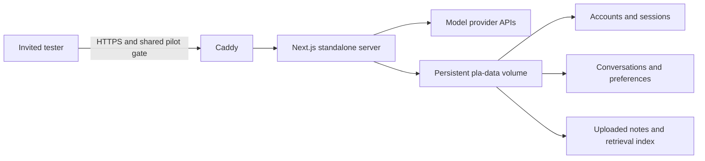

# Pilot Deployment Guide

This guide describes an operator-run, controlled deployment for a small group of testers: one Node.js process, one durable data volume, and one reverse proxy. Local implementation evidence is recorded in [Implementation Progress](improvement-progress.md); recruiting testers, exercising a real deployed service, and conducting physics review are separate activities.

## Deployment shape


```mermaid
flowchart LR
  Tester["Invited tester"] -->|HTTPS and shared pilot gate| Proxy["Caddy"]
  Proxy --> App["Next.js standalone server"]
  App --> Model["Model provider APIs"]
  App --> Volume["Persistent pla-data volume"]
  Volume --> Accounts["Accounts and sessions"]
  Volume --> Workspace["Conversations and preferences"]
  Volume --> Documents["Uploaded notes and retrieval index"]
```

The included Compose stack provides:

- a standalone Next.js container;
- automatic HTTPS through Caddy when a real domain is configured;
- a shared Basic Auth gate for a closed pilot;
- unbuffered proxying for streamed model responses;
- a persistent Docker volume for `PLA_DATA_DIR`;
- application and upstream health checks;
- graceful shutdown for in-flight requests.

## Host requirements

Use one Linux host with enough memory and disk for the selected document workload and backups. Measure parsing, provider latency, and concurrent generation before choosing capacity. Keep one application replica: JSON locks, rate limits, generation concurrency, and daily output pools are process-local.

Select the deployment region and applicable hosting requirements with the operator. The repository does not choose a cloud region or complete regulatory procedures. Browser account caches, server workspace data, private source files, and the selected model provider's handling of retrieved excerpts need to be included in the tester notice.

## 1. Prepare the server

Install Git, Docker Engine, and the Docker Compose plugin on the chosen Linux host. The document parser requires Node.js 22.13 or later; the bundled image uses Node.js 22. Verify its native parser/image dependencies on that host. In the firewall:

- allow TCP `22` only from an administrator IP where possible;
- allow TCP `80` and `443` from testers;
- allow UDP `443` if HTTP/3 is desired;
- do not expose application port `3000` publicly.

Point a domain or test subdomain at the server's public IP before starting Caddy.

## 2. Configure the application

```bash
git clone https://github.com/lizr-phys/physics-learning-agent.git
cd physics-learning-agent
cp .env.production.example .env.production
chmod 600 .env.production
```

Generate a password hash for the outer pilot gate:

```bash
docker run --rm caddy:2-alpine caddy hash-password --plaintext "choose-a-strong-pilot-password"
```

Edit `.env.production` and set:

- `PLA_SITE_ADDRESS` to the test domain, without `https://`;
- `PLA_PILOT_USERNAME` and the generated `PLA_PILOT_PASSWORD_HASH`;
- the server-side DeepSeek settings, or leave the default key empty and require testers to use Bring Your Own Key;
- `PLA_DATA_DIR=/data`.

Never commit `.env.production`.

Configure the generation controls explicitly:

```txt
PLA_GENERATION_ENABLED=true
PLA_GENERATION_MAX_CONCURRENT_PER_USER=2
PLA_GENERATION_MAX_CONCURRENT_GLOBAL=8
PLA_GENERATION_DAILY_OUTPUT_TOKENS_PER_USER=100000
PLA_GENERATION_DAILY_OUTPUT_TOKENS_GLOBAL=500000
```

Concurrency applies to default-key and BYOK requests. Daily output pools apply to the server default and reset at midnight UTC. A practice task reserves up to 24,000 output tokens; ordinary answers reserve their configured upper bound. Known output usage settles the reservation. Missing usage, interrupted connections, and cancellations retain the reservation conservatively. Invalid limit values reject generation instead of disabling protection.

`PLA_GENERATION_ENABLED=false` rejects new generation requests. Existing requests still need to finish or be stopped. Process restart resets these counters; they are an admission control for this single instance, not a billing ledger or a monetary spending cap. Set provider-side spending limits as well. Multi-instance or durable accounting requires shared storage.

Before inviting users, run the production dependency audit and review the full-tree exceptions in [Dependency Review](dependency-audit.md). The development `braces` exception must stay limited to repository-controlled tooling; keep development/lint services off public interfaces. Do not use `npm audit fix --force` as an upgrade plan.

## 3. Start and verify

```bash
docker compose up -d --build
docker compose ps
docker compose logs --tail=100 app proxy
```

Verify the internal readiness endpoint:

```bash
docker compose exec app node -e "fetch('http://127.0.0.1:3000/api/health').then(async r => { console.log(r.status, await r.text()); process.exit(r.ok ? 0 : 1) })"
```

Then open the HTTPS domain, enter the shared pilot credentials, and test:

1. account registration and sign-in;
2. a streamed chat response;
3. practice generation and LaTeX rendering;
4. document upload, retrieval, and deletion;
5. A signs out and B signs in on the same browser; no automatic import occurs and delayed A responses cannot enter B's workspace;
6. explicit anonymous/legacy import choices, refresh, second-device synchronization, concurrent edits, and deletion replay;
7. provider EOF, truncation, cancellation, and retry, with partial output and a truthful terminal state;
8. practice interruption/reload recovery, stable assessment IDs, folded answers, and `.tex` export;
9. desktop/mobile scrolling, tables, long formulas, keyboard composition, input area, and the mobile sidebar.

Use dedicated pilot accounts and files. Automated browser checks use mock providers and an isolated test data directory; successful tests do not replace this host exercise or a real-model check. Confirm `Saved` before treating a workspace as synchronized, and test `Offline`, `Sync failed`, and quota recovery.

## 4. Back up persistent data

The named volume `pla-pilot-data` contains account records, sessions, workspace snapshots, deletion markers, source excerpts saved in answers, practice state, uploaded documents, and retrieval indexes. Back it up before every upgrade and at least daily during a pilot. Restrict access to both the live volume and backups.

```bash
mkdir -p backups
docker run --rm \
  -v pla-pilot-data:/data:ro \
  -v "$PWD/backups:/backup" \
  alpine sh -c 'tar czf /backup/pla-data-$(date +%Y%m%d-%H%M%S).tgz -C /data .'
```

Copy backups off the application server. A backup stored only on the same disk does not protect against instance or disk loss.

Exercise restoration into a new empty volume while keeping the live volume intact:

```bash
docker volume create pla-pilot-restore-check
docker run --rm \
  -v pla-pilot-restore-check:/data \
  -v "$PWD/backups:/backup:ro" \
  alpine sh -c 'test -z "$(ls -A /data)" && tar xzf /backup/REPLACE_WITH_BACKUP.tgz -C /data'
```

Start an isolated test instance against the restored volume, with mock model access, and verify accounts, workspace revisions, practice recovery, and document sources. Record the backup timestamp, restored record counts, elapsed recovery time, and failures. Switching the live service to a restored volume is a separate operator action after verification.

## 5. Upgrade and roll back

```bash
git pull --ff-only
docker compose up -d --build
docker compose ps
```

Keep the previous Git commit and a data backup. If verification fails, check out the previous commit and rebuild. Do not run two application replicas against the same JSON data volume.

## Pilot guardrails

- Keep the shared Caddy gate enabled for the closed test.
- Set a provider spending limit and monitor usage daily.
- Monitor generation admission errors and disk capacity; token reservations do not account for provider prices or all input-token charges.
- Give each tester an application account; do not share application passwords.
- Do not collect hidden analytics. Ask for explicit consent before exporting or aggregating feedback.
- Ask testers to upload only materials they own or are permitted to use.
- Do not ask testers to paste API keys, passwords, personal information, or private notes into GitHub issues.
- Rotate the shared pilot password and provider key after the test.
- Delete test accounts and uploaded materials according to the retention period communicated to testers.

Anonymous and account browser workspaces remain separate. Sign-out clears temporary BYOK keys and opens the anonymous workspace, while account caches stay on that browser. Shared devices should use separate browser profiles. Deleting a library document removes its source file and index; snippets already saved in private conversations remain until those records are deleted. Backups follow the operator's declared retention policy.

## Pilot design

After the technical gates are met, plan an invitation-only trial with 10 to 20 undergraduate physics students for 7 to 14 days. Begin with one or two well-prepared courses from the six supported course groups, using desktop and mobile devices. These are proposed recruitment parameters; no recruitment or outcome results are implied.

Each tester should complete the same baseline tasks:

1. ask one conceptual question and one derivation question;
2. make a contextual follow-up such as "why does this condition matter?";
3. generate a five-problem practice set and reveal hints before solutions;
4. upload one short, user-owned note and ask a grounded question;
5. switch or delete a conversation during generation;
6. submit one structured feedback report.

Track a small set of decision-oriented metrics:

| Metric | Pilot question |
| --- | --- |
| Task completion | Could the student finish the intended learning task? |
| Answer usefulness | Did the response help the student move forward? |
| Physics correctness | Were assumptions, equations, units, and conclusions consistent? |
| Retrieval grounding | Did cited personal notes support the answer? |
| Generation reliability | Did streaming finish or recover without losing content? |
| Return intent | Would the student use the tool for another study session? |

Use the repository's **Pilot feedback** issue form for reproducible product or engineering problems. Collect broader learning interviews separately so public issues do not contain student or document data.

Use [Pilot Evaluation](pilot-evaluation.md) for consented exports, aggregate reports, a blank human-review record, and failure attribution. Format-valid practice blocks, helpful votes, and solved marks are not physics validation or measured learning gains.

## Exit criteria

Expand beyond the closed pilot only after:

- critical cross-session streaming failures remain at zero;
- cross-account, stale-response, deletion-replay, and quota checks pass on the actual host;
- backups and restores have been exercised;
- model cost per active tester is understood;
- the most common correctness and retrieval failures have regression cases;
- the privacy notice and data-retention process match the actual deployment;
- storage, sessions, and rate limits have a migration plan before adding replicas.

Live-provider protocol availability, real document behavior, human physics review, backup restoration, and deployed latency must have their own evidence. Leave absent measurements unfilled; local mock-provider test results cannot supply them.

## References

- [Tencent Cloud: Docker on Lighthouse](https://cloud.tencent.com/document/product/1207/60423)
- [Tencent Cloud: ICP filing scenarios](https://cloud.tencent.com/document/product/243/18910)
- [Tencent Cloud: eligible cloud resources for ICP filing](https://cloud.tencent.com/document/product/243/18908)
- [Next.js self-hosting](https://nextjs.org/docs/app/guides/self-hosting)
- [Caddy Basic Auth](https://caddyserver.com/docs/caddyfile/directives/basic_auth)
- [Caddy reverse proxy streaming](https://caddyserver.com/docs/caddyfile/directives/reverse_proxy)
