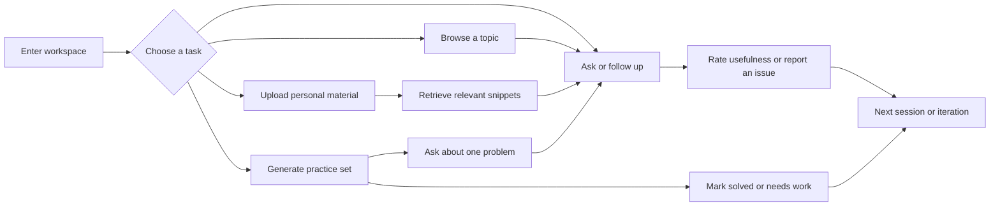
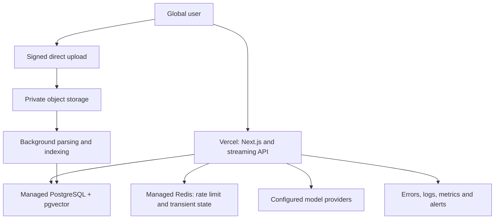

# Physics Learning Agent 上线前产品需求文档

> 文档性质：产品需求文档（PRD）与上线验收基线  
> 当前状态：上线前评审  
> 文档版本：v1.0  
> 产品基线：`main` / `489b001`  
> 基线日期：2026-07-22  
> 目标版本：国际化封闭测试版  
> 产品负责人：待确认  
> 技术负责人：待确认  
> 目标发布日期：待排期  

## 0. 文档说明

### 0.1 目的

本文档用于统一 Physics Learning Agent 上线前的产品范围、用户价值、功能要求、质量门槛、数据口径和发布流程，并作为以下工作的共同依据：

- 产品、设计、工程与测试评审；
- 上线范围确认与变更控制；
- 封闭测试招募、任务设计和结果判断；
- 上线后反馈归因、优先级评估与版本迭代；
- 国际版部署及后续中国大陆版本的架构决策。

本文档不是开发日志。除“当前能力”外，文中出现的目标架构和待办项均不表示已经实现。

### 0.2 状态标记

| 标记 | 含义 |
| --- | --- |
| 已实现 | 当前代码可用，并已有相应测试或可执行验证路径 |
| P0 | 上线阻断项；未完成不得进入目标测试范围 |
| P1 | 封闭测试期应完成；可在不影响安全与数据完整性的前提下延期 |
| P2 | 后续优化项；不属于本次上线承诺 |
| 待确认 | 需要产品、技术、合规或运营负责人作出明确决策 |
| 待回填 | 上线后依据真实数据填写，不在上线前预设结论 |

### 0.3 关联文档

- [项目架构](./architecture.md)
- [封闭测试部署指南](./pilot-deployment.md)
- [质量评测说明](../src/evaluation/README.md)
- [项目说明](../README.md)
- [安全策略](../SECURITY.md)

## 1. 产品定义

### 1.1 产品定位

Physics Learning Agent 是面向本科阶段物理学习的对话式工作台。产品以学习对话和原创练习题为主线，结合课程知识结构、上下文记忆、个人资料检索和多模型调用，为概念理解、公式推导、习题训练和连续追问提供统一入口。

产品界面默认使用英文；回答语言根据用户输入和明确指令在中文与英文之间切换。系统分别适配中文本科课程传统和英文教材、公开课程问题集的术语与训练方式。

### 1.2 核心问题

通用大模型可以回答单个问题，但在本科物理学习中仍存在四类稳定缺口：

1. **课程语境不稳定**：同一术语在不同课程、教材传统和难度层级下含义不同。
2. **解答缺少教学约束**：回答可能省略假设、边界条件、归一化、量纲检查或结果适用范围。
3. **训练闭环不足**：题目生成、提示、解析、答案和后续追问通常彼此割裂。
4. **个人资料利用困难**：讲义、笔记和试题分散，检索结果缺少会话上下文和来源提示。

### 1.3 产品假设

| 编号 | 假设 | 验证方式 | 失效后的处理 |
| --- | --- | --- | --- |
| H1 | 学生更愿意在同一工作台完成提问、追问和练习 | 任务完成率、访谈、7 日回访 | 收敛主流程，减少低频入口 |
| H2 | 课程约束和结构化提示能提高回答可用性 | 盲评对照、错误类型统计 | 调整分类、prompt 和评测集 |
| H3 | 隐藏答案、分层提示比一次性展示完整解析更利于主动练习 | 提示/答案展开路径、访谈 | 调整默认输出模式 |
| H4 | 个人知识库能提高针对讲义和笔记提问的效率 | 检索命中率、引用支持率、任务成功率 | 优化切分、检索和引用策略 |
| H5 | 英文界面与双语回答可服务国内外两类用户 | 语言分布、完成率、术语反馈 | 调整界面语言策略与参考体系 |

### 1.4 产品原则

1. 先解决用户当前问题，再提供学习结构。
2. 物理结论必须与前提、符号和适用条件一致。
3. 非物理问题正常回答，不强行套用物理模板。
4. 生成练习题只借鉴题型组织方式，不复制教材或公开课程原题。
5. 本地资料只按用户授权范围检索，不跨账号混用。
6. 流式生成、会话切换和错误恢复必须保持状态隔离。
7. 所有上线结论由可复现测试和真实反馈支持。

## 2. 目标与非目标

### 2.1 本次上线目标

| 编号 | 目标 | 上线后判断指标 |
| --- | --- | --- |
| G1 | 用户能在 10 分钟内完成一次有效学习任务 | 新用户任务完成率不低于 70% |
| G2 | 对话能稳定支持概念、推导、解题和连续追问 | 基准任务完成率不低于 80%；跨会话污染为 0 |
| G3 | 练习题具备完整条件、合理难度和可用解析 | 抽检合格率不低于 90%；题目数量完整率不低于 95% |
| G4 | 个人知识库能返回可核对的相关片段 | 检索 Recall@3 不低于 0.75；引用支持率不低于 80% |
| G5 | 建立可执行的反馈与迭代闭环 | 100% 严重问题可追踪；每轮测试形成书面结论 |

上述阈值用于小范围试测的方向判断，不构成统计显著性结论。样本量、分母和缺失数据必须与结果同时记录。

### 2.2 商业目标

当前阶段不验证付费转化。优先验证：

- 学习任务是否真实存在且高频；
- 产品相对通用对话模型是否形成稳定差异；
- 用户是否愿意在一周内再次使用；
- 单次有效学习任务的模型与基础设施成本是否可控。

### 2.3 非目标

本次上线不包含：

- 正式课程管理系统、作业发布或教师后台；
- 学分、考试成绩或能力认证；
- 教材全文托管、受版权保护内容的公共共享；
- 自动替代教师进行高风险学业判断；
- 支付、订阅、组织权限和企业多租户；
- 生产级多 Agent 并行调用；
- 完整自适应学习算法或知识追踪模型；
- 面向未成年人的专门产品方案。

## 3. 目标用户与任务

### 3.1 核心用户

| 用户类型 | 主要特征 | 主要任务 | 当前优先级 |
| --- | --- | --- | --- |
| 中文课程学习者 | 国内高校物理或相关专业本科生 | 理解概念、完成课程复习、训练期末或考研风格题 | P0 |
| 英文课程学习者 | 使用英文教材或公开课程资源的本科生 | 阅读英文术语、完成教材式练习、追踪推导 | P0 |
| 双语学习者 | 中文课程背景，需要阅读英文教材 | 对照术语、切换解释语言、使用不同题目风格 | P1 |
| 高年级进阶学习者 | 需要更完整推导和个人资料检索 | 深入推导、跨章节联系、基于讲义追问 | P1 |

教师、助教和课程运营人员可参与测试，但不是当前主要产品对象。

### 3.2 核心待办任务（Jobs to Be Done）

1. 当我无法理解一个物理概念时，希望先获得直观解释，再看到规范数学表达和适用条件。
2. 当我卡在推导或习题步骤时，希望系统结合前文解释“为什么这样做”，而不是重新回答整道题。
3. 当我需要训练某一知识点时，希望生成条件完整、难度匹配且答案可隐藏的原创题目。
4. 当我使用自己的讲义或笔记学习时，希望系统检索相关片段，并说明回答参考了哪份资料。
5. 当我切换课程、语言或题目风格时，希望后续回答继承新语境，而不受旧模板干扰。

### 3.3 关键使用场景

| 场景 | 输入示例 | 预期结果 |
| --- | --- | --- |
| 概念理解 | “解释 Green 函数与边界条件的关系” | 中文回答；区分算符、定义域、边界条件和物理意义 |
| 推导学习 | “Derive the harmonic oscillator spectrum step by step.” | 英文回答；说明假设、算符方法和能级检验 |
| 练习生成 | “按中文期末风格出 5 道分离变量法题” | 原创题；完整初边值条件；提示、解析、答案可折叠 |
| 连续追问 | “Why is that boundary term zero?” | 读取当前会话和学习记忆，定位所指步骤 |
| 个人资料问答 | “按我上传的第三章笔记解释这个符号” | 自动或主动启用个人检索，展示可核对来源 |
| 非物理问题 | “Help me revise this email.” | 直接完成邮件修改；结尾仅作一次轻量产品定位提示 |

## 4. 当前能力与上线范围

### 4.1 当前已实现

| 模块 | 当前能力 | 边界 |
| --- | --- | --- |
| Chat | 流式回答、会话历史、上下文记忆、回答深度、停止/继续、反馈 | 模型质量依赖供应商；长期记忆为轻量结构化摘要 |
| Practice Problems | 课程、知识点、难度、数量、输出方式、题目风格、折叠答案、LaTeX 导出 | 输出仍为模型生成，需要抽检和中断恢复 |
| Knowledge Map | 六个课程组的主题、前置知识、关联、公式、题型和误区 | 内容为静态知识目录，不等同教材全文 |
| Personal Knowledge | 账号、文件上传、解析、切分、检索、重建索引、删除 | 当前使用单机文件与 JSON；扫描 PDF 不含 OCR |
| Agent Workflow | LangGraph 输入理解、上下文、记忆、检索规划、检索、生成准备 | 单次主模型生成，不是多模型协作系统 |
| Model Settings | 服务端 DeepSeek 与多供应商 BYOK、连接测试、错误诊断 | BYOK 密钥仅保存在当前浏览器会话 |
| Rendering | Markdown、KaTeX、表格、代码和长公式横向滚动 | 非法或截断公式可能降级显示原文 |
| Quality | 单元、集成、浏览器和离线 Agent 质量基线 | 离线评测不代表最终模型回答正确率 |

课程范围：普通物理、数学物理方法、经典力学、电动力学、量子力学、热力学与统计物理。

### 4.2 目标测试版本范围

目标测试版本保留以下一级入口：

- Chat
- Practice Problems
- Knowledge Map
- Personal Knowledge
- API Settings

已移除的板块复习和题型梳理不恢复为独立模块；相关学习需求由 Chat 和 Practice Problems 承接。

### 4.3 上线阻断项

| 编号 | 阻断项 | 原因 | 验收结果 |
| --- | --- | --- | --- |
| BLK-01 | 确定部署形态和数据存储 | 当前 `PLA_DATA_DIR` 仅适合单实例 | 待确认 |
| BLK-02 | 若使用 Vercel，迁移账号、会话和文档元数据到数据库 | Serverless 实例不能依赖本地持久化 | 待完成 |
| BLK-03 | 若使用 Vercel，文件改为对象存储直传 | 当前 12 MB 上传超过 Function 4.5 MB 请求体上限 | 待完成 |
| BLK-04 | 全局限流与成本上限 | 当前内存限流不能覆盖多实例 | 待完成 |
| BLK-05 | 隐私声明、使用条款、数据删除和保留周期 | 涉及账号、聊天和用户文件 | 待完成 |
| BLK-06 | 错误监控、告警和脱敏日志 | 线上故障需可定位且不得泄露内容或密钥 | 待完成 |
| BLK-07 | 上传安全基线 | 文档解析属于高风险输入面 | 待完成 |
| BLK-08 | 生产环境备份与恢复演练 | 必须验证数据可恢复，而非仅有备份脚本 | 待完成 |

## 5. 信息架构与主流程

### 5.1 页面结构

| 路由 | 页面 | 用户目标 | 登录要求 |
| --- | --- | --- | --- |
| `/`、`/chat` | Chat | 提问、追问、使用个人资料、管理会话 | 基础使用否；云端同步是 |
| `/practice` | Practice Problems | 生成、展开、评估、导出和追问题目 | 否；云端历史同步是 |
| `/map` | Knowledge Map | 浏览课程结构并进入学习任务 | 否 |
| `/knowledge-base` | Personal Knowledge | 上传、索引、重建和删除个人资料 | 是 |
| `/settings/api` | API Settings | 检查服务端模型或配置临时 BYOK | 否 |
| `/api/health` | Health | 部署健康检查 | 运维使用 |

### 5.2 核心闭环



### 5.3 首次使用路径

1. 用户进入 Chat，看到不阻塞操作的简短引导。
2. 用户直接输入问题，或点击推荐内容后编辑。
3. 用户消息立即进入当前会话，生成状态可见。
4. 回答流式展示；完成后渲染 Markdown 与 LaTeX。
5. 用户继续追问、提交反馈或进入 Practice Problems。
6. 需要个人资料时，引导登录并上传用户有权处理的文件。

## 6. 功能需求

### 6.1 Chat

| 编号 | 优先级 | 需求 | 验收条件 |
| --- | --- | --- | --- |
| FR-CHAT-01 | P0 | 支持新建、切换、重命名和删除会话 | 刷新后状态一致；空白会话不重复创建 |
| FR-CHAT-02 | P0 | 流式请求绑定 `conversationId`、`assistantMessageId`、`requestId` | 新建、切换或删除时旧内容不进入当前会话 |
| FR-CHAT-03 | P0 | 用户停止或网络中断后保留已生成内容 | 展示停止/中断状态，并提供继续或重试 |
| FR-CHAT-04 | P0 | 支持中文和英文回答 | 默认跟随用户主要语言；明确语言指令优先 |
| FR-CHAT-05 | P0 | 根据意图选择物理、练习、学习规划、通用或产品帮助策略 | 非物理问题不套物理模板；物理问题保持课程约束 |
| FR-CHAT-06 | P0 | 读取有界最近历史与结构化学习记忆 | “为什么”“继续”“再来两道”等追问可解析前文对象 |
| FR-CHAT-07 | P0 | 提供自动、始终、从不使用个人知识三种模式 | 当前会话和账号之间不串用资料 |
| FR-CHAT-08 | P1 | 支持简洁、标准、详细、推导优先、题型优先 | 设置持久化；回答长度和结构有可观察差异 |
| FR-CHAT-09 | P0 | Markdown、LaTeX、代码、表格完整显示 | 长公式横向滚动；单个公式错误不导致整条回答消失 |
| FR-CHAT-10 | P1 | 对回答提交“有帮助/需改进”及问题类型 | 反馈绑定具体消息，不记录 API Key |

#### 回答行为

- 概念题：直观解释、数学表达、物理意义、例子、常见误区。
- 推导题：前提、起始方程、步骤理由、结果、适用条件和检验。
- 习题题：考查点、已知量、求解路线、计算、结果与方法总结。
- 非物理题：直接回答；仅在结尾保留一句克制的产品定位提示。
- 信息不足：说明采用的常见解释和假设，不以连续反问阻断任务。

### 6.2 Practice Problems

| 编号 | 优先级 | 需求 | 验收条件 |
| --- | --- | --- | --- |
| FR-PRAC-01 | P0 | 用户可选择课程、知识点、难度、数量和自然语言要求 | 初始课程为空；自然语言可补充或识别课程 |
| FR-PRAC-02 | P0 | 支持 3、5、10 题 | 返回题数与请求一致；不足时可从下一题继续 |
| FR-PRAC-03 | P0 | 支持中文教材、中文期末、中文考研、英文教材和公开课程风格 | `Auto` 根据语言和明确要求选择参考体系 |
| FR-PRAC-04 | P0 | 支持只给题目、题目加提示、完整解析和隐藏答案 | prompt 与前端展示均遵循选项 |
| FR-PRAC-05 | P0 | 题目为原创变式，条件、符号和目标完整 | 不声明来自具体教材、页码、真题或官方课程 |
| FR-PRAC-06 | P0 | 每题独立分块；题干展开，提示、解析和答案默认折叠 | 展开操作不破坏公式渲染 |
| FR-PRAC-07 | P0 | 单题可携带上下文进入 Chat | Chat 显示简洁来源提示，模型可识别“这道题” |
| FR-PRAC-08 | P1 | 支持 `.tex` 导出 | 下载文件可由常用 LaTeX 引擎编译；不包含未转义正文 |
| FR-PRAC-09 | P1 | 支持标记 `Solved` 或 `Needs work` | 状态与题目索引绑定，刷新后保留 |
| FR-PRAC-10 | P0 | 长输出可停止、继续和重试 | 部分内容不丢失；继续时不重复已完成题目 |

#### 题目质量约束

1. 边值和初边值问题必须说明区域、方程及必要条件。
2. 分析力学题必须说明约束、自由度或广义坐标选择依据。
3. 电动力学题必须区分场量、介质、边界和适用区域。
4. 量子定态题必须说明势、边界和物理允许态条件。
5. 热统题必须说明系统、系综、粒子统计和近似条件。
6. 解析不得只给结论；答案与题目条件、量纲和符号必须一致。

### 6.3 Knowledge Map

| 编号 | 优先级 | 需求 | 验收条件 |
| --- | --- | --- | --- |
| FR-MAP-01 | P0 | 按课程与学习顺序浏览知识点 | 六个课程组可访问；列表与详情局部切换 |
| FR-MAP-02 | P0 | 展示定义、前置、关联、公式、典型题和误区 | 所有界面标签和静态说明为英文 |
| FR-MAP-03 | P0 | 公式使用统一 Markdown/KaTeX 渲染 | 不出现裸露分隔符或容器裁切 |
| FR-MAP-04 | P0 | 从知识点进入 Chat 或 Practice Problems | 课程、知识点和初始请求隐式传递 |
| FR-MAP-05 | P1 | 知识点采用稳定 ID，显示内容支持本地化 | 切换显示语言不改变引用关系 |

Knowledge Map 是课程导航，不承担教材全文或正式课程标准的角色。

### 6.4 Personal Knowledge

| 编号 | 优先级 | 需求 | 验收条件 |
| --- | --- | --- | --- |
| FR-KB-01 | P0 | 注册或登录后管理个人资料 | 未登录用户不能查看、上传或删除资料 |
| FR-KB-02 | P0 | 支持允许列表内的文本型文档 | 格式、真实类型、大小和文件名均校验 |
| FR-KB-03 | P0 | 展示上传、解析、索引、失败和删除状态 | 失败原因可理解；失败文件不进入检索 |
| FR-KB-04 | P0 | 文档可附加课程、主题和描述 | 元数据进入切分与检索排序 |
| FR-KB-05 | P0 | 支持重建索引和彻底删除 | 删除后原文件、元数据和分块均不可检索 |
| FR-KB-06 | P0 | 回答展示文档名、标题和可用定位信息 | 不伪造页码；片段不足时明确说明 |
| FR-KB-07 | P0 | 文档和检索结果按用户隔离 | 账号 A 无法读取账号 B 的文件、元数据和片段 |
| FR-KB-08 | P1 | 扫描文档明确提示 OCR 要求 | 未提取到文本时不产生空索引假成功 |

#### 当前与目标检索链路

当前版本使用格式感知提取、LangChain 文本切分、关键词/BM25、短语、标题和元数据加权。向量检索尚未作为默认生产能力。

国际测试版目标链路：


### 6.5 Accounts and Persistence

| 编号 | 优先级 | 需求 | 验收条件 |
| --- | --- | --- | --- |
| FR-AUTH-01 | P0 | 邮箱和密码注册、登录、退出 | 密码使用强 KDF；会话 Cookie 为 HttpOnly、SameSite、生产环境 Secure |
| FR-AUTH-02 | P0 | 登录用户同步会话、练习历史、偏好和学习画像 | 第二设备登录后读取同一账号数据 |
| FR-AUTH-03 | P0 | 匿名数据保留在浏览器 | 不自动合并到他人账号；迁移需明确确认 |
| FR-AUTH-04 | P0 | 支持账号数据删除 | 删除范围、处理时限和结果可确认 |
| FR-AUTH-05 | P1 | 会话失效、退出和密钥轮换策略明确 | 被撤销会话不能继续访问 API |

当前账号和工作区数据存储在单机 JSON 文件。该方案只适用于单 Node 进程；Vercel 目标版本必须迁移到事务型数据库。

### 6.6 Model Provider Settings

| 编号 | 优先级 | 需求 | 验收条件 |
| --- | --- | --- | --- |
| FR-MODEL-01 | P0 | 服务端默认模型通过环境变量配置 | API Key 不进入客户端 bundle、响应或日志 |
| FR-MODEL-02 | P0 | 支持 OpenAI、DeepSeek、Qwen、Kimi、GLM、Claude、Gemini、OpenRouter 和兼容端点 | 连接测试返回可理解状态 |
| FR-MODEL-03 | P0 | BYOK 密钥仅保留在浏览器 `sessionStorage` | 刷新策略明确；不写 localStorage、数据库或服务端文件 |
| FR-MODEL-04 | P0 | 自定义地址执行服务端 URL 安全校验 | 生产环境拒绝 HTTP、回环、私网、元数据及保留地址 |
| FR-MODEL-05 | P1 | 展示最近一次脱敏错误和响应模式 | 不显示密钥、完整 prompt 或私人资料 |

### 6.7 Internationalization

| 编号 | 优先级 | 需求 | 验收条件 |
| --- | --- | --- | --- |
| FR-I18N-01 | P0 | 产品 UI 统一使用英文 | 页面、按钮、空状态、错误和帮助文本不混入中文 |
| FR-I18N-02 | P0 | 回答语言独立于 UI | 中文问题主要中文回答；英文问题主要英文回答 |
| FR-I18N-03 | P0 | 明确语言指令覆盖自动检测 | “answer in English”等指令在当前回答生效 |
| FR-I18N-04 | P0 | 语言与练习风格进入会话记忆 | “make it harder”继承上一轮语言和题目体系 |
| FR-I18N-05 | P1 | 日期、时区和数字显示使用 locale-aware API | 不依赖服务器默认地区格式 |
| FR-I18N-06 | P1 | UI 文案从组件硬编码迁移到字典 | 新增页面必须使用统一文案键 |

## 7. Agent 工作流要求

### 7.1 工作流结构

当前 LangGraph 工作流保留六个确定性节点：

| 节点 | 职责 | 失败处理 |
| --- | --- | --- |
| `understandInput` | 识别意图、语言和参考体系 | 降级为通用问答，不拒绝用户 |
| `resolveContext` | 解析课程、知识点、任务类型和有界历史 | 使用当前会话显式上下文；不读取其他会话 |
| `updateMemory` | 更新课程、目标、困惑、风格和摘要 | 保留上一份有效记忆 |
| `planRetrieval` | 决定是否检索个人或样例资料 | 资料不足时不阻断回答 |
| `retrieveKnowledge` | 获取账号范围内相关片段 | 超时或无命中时记录原因并继续 |
| `prepareGeneration` | 组装受控 prompt 与模型参数 | 参数校验失败时返回明确错误 |

### 7.2 决策优先级

1. 用户当前明确指令；
2. 当前消息可验证的意图和语言；
3. 当前会话上下文与 Tool Context；
4. 结构化学习记忆；
5. 课程和参考体系默认值。

任何历史上下文均不得覆盖用户当前明确切换课程、语言或任务的指令。

### 7.3 上下文预算

- 最近历史：最多 20 条有效消息；单条内容有长度上限。
- 会话摘要：保留课程、知识点、目标、困惑、已讲结论和练习方向。
- Tool Context：优先保留所选题目；长结果截断后必须标注边界。
- RAG：只注入最相关且去重的有限片段。
- API Key、密码、Cookie 和内部错误栈不得进入 prompt。

### 7.4 输出后处理

后处理负责：

- 统一数学分隔符并保护代码块；
- 清除不必要的套话；
- 保持回答语言一致；
- 检查练习题数量和章节结构；
- 添加必要的资料来源列表；
- 对长度截断、流中断和手动停止生成显式控制事件。

后处理不得修改物理结论或静默补造引用。

## 8. 数据模型与数据治理

### 8.1 目标实体

| 实体 | 主要字段 | 保存目的 |
| --- | --- | --- |
| User | ID、邮箱、名称、密码摘要、状态、时间戳 | 身份与账号生命周期 |
| Session | ID、用户 ID、令牌摘要、过期时间 | 登录会话 |
| Conversation | ID、用户 ID、标题、上下文、学习记忆 | 多轮学习连续性 |
| Message | ID、会话 ID、角色、内容、状态、请求 ID、反馈 | 对话与流式恢复 |
| Practice Set | ID、参数、原始请求、结果、状态 | 练习历史与继续生成 |
| Practice Assessment | 题目索引、Solved/Needs work、时间 | 轻量学习反馈 |
| Document | ID、用户 ID、对象键、类型、状态、元数据 | 个人资料管理 |
| Chunk | 文档 ID、文本、定位、稀疏/稠密索引字段 | 个人资料检索 |
| Learning Profile | 常用课程、近期主题、语言、风格 | 连续体验和推荐 |
| Product Event | 匿名用户/账号 ID、事件、时间、非敏感属性 | 产品分析与故障定位 |

### 8.2 数据分级

| 级别 | 示例 | 处理要求 |
| --- | --- | --- |
| 高敏感 | 密码、API Key、会话令牌 | 不记录明文；严格限制访问；支持轮换和撤销 |
| 私有学习数据 | 对话、上传文件、检索片段 | 账号隔离；传输加密；可删除；不得进入公开 Issue |
| 产品诊断数据 | 请求状态、耗时、错误码、模型名 | 脱敏；不含完整 prompt 和文档正文 |
| 公共静态数据 | 课程目录、样例资料、帮助文档 | 版本管理和内容审核 |

### 8.3 数据保留

上线前必须确认：

- 账号删除后数据清理时限：待确认；
- 已删除文件及备份中的最长保留时间：待确认；
- 对话和练习历史默认保留期限：待确认；
- 脱敏诊断日志保留期限：建议 30 天，待确认；
- 封闭测试结束后的测试账号处理方式：待确认。

## 9. 非功能需求

### 9.1 稳定性

| 编号 | 指标 | 上线门槛 |
| --- | --- | --- |
| NFR-REL-01 | 跨会话流式内容污染 | 0 次 |
| NFR-REL-02 | 删除会话后旧消息复活 | 0 次 |
| NFR-REL-03 | 生成请求正常完成或明确终止 | 不允许静默卡死 |
| NFR-REL-04 | 支持格式文档索引成功率 | 不低于 95% |
| NFR-REL-05 | 数据备份恢复 | 至少完成一次演练并记录 RPO/RTO |

### 9.2 性能

以下目标在约定测试地区、网络和模型下测量：

| 编号 | 指标 | 目标 |
| --- | --- | --- |
| NFR-PERF-01 | 首屏可交互时间 p75 | 不高于 2.5 秒 |
| NFR-PERF-02 | 客户端页面切换 p75 | 不高于 1 秒 |
| NFR-PERF-03 | 首个模型文本 p50 / p95 | 不高于 5 秒 / 15 秒 |
| NFR-PERF-04 | 有持续 chunk 时的错误超时 | 不得误触发 |
| NFR-PERF-05 | 长回答滚动与输入 | 无明显阻塞；输入框不随内容位移 |

模型供应商延迟必须与应用自身延迟分开记录。

### 9.3 安全

上线安全基线参考 OWASP ASVS 的认证、会话、访问控制、输入验证、数据保护、文件与 API 要求：

- 强制 HTTPS；
- 服务端密钥只存环境变量或密钥服务；
- 密码使用 scrypt 等强 KDF，并使用独立随机盐；
- Cookie 使用 HttpOnly、SameSite，生产环境启用 Secure；
- 所有对象访问均校验资源所有者；
- 上传扩展名、实际类型、大小和文件名使用允许列表；
- 文件使用服务端生成的存储键，并置于非公开对象存储；
- 文档解析进程设置资源、时间和递归限制；
- 自定义模型端点防止 SSRF；
- 日志禁止记录密码、API Key、令牌、完整私人文档和原始 Authorization Header；
- 发布前执行依赖审计、权限测试和跨账号访问测试。

### 9.4 隐私与版权

- 上传前说明允许的资料范围和处理目的。
- 用户只能上传本人拥有或有权处理的内容。
- 不将用户文件用于公共训练或共享索引，除非另行取得明确同意。
- 生成题不得声称来自具体教材、真题或 MIT OpenCourseWare 官方题目。
- 来源样式只描述训练传统，不构成内容来源声明。
- 提供数据导出、删除和联系方式；具体政策由上线地区确认。

### 9.5 可访问性

目标为 WCAG 2.2 AA 的核心交互要求：

- 所有功能可使用键盘完成；
- 焦点可见且不被固定输入区遮挡；
- 表单具有关联标签和明确错误；
- 状态变化通过可访问文本表达，不仅依赖颜色；
- 触控目标尺寸、对比度和移动端阅读宽度满足基本要求；
- 数学内容提供可选择文本，错误渲染时保留原文。

### 9.6 兼容性

上线前至少验证：

- 桌面：最新两个稳定版本的 Chrome、Edge、Firefox、Safari；
- 移动：iOS Safari、Android Chrome；
- 视口：375×667、390×844、768×1024、1440×900；
- 网络：稳定宽带、受限移动网络、请求中断与恢复；
- 输入：中文输入法、英文键盘、Shift+Enter、虚拟键盘。

## 10. 国际版部署方案

### 10.1 推荐目标架构



### 10.2 Vercel 适配要求

| 项目 | 当前实现 | 上线目标 |
| --- | --- | --- |
| Next.js UI 与 API | 可构建、可流式 | 保留 Vercel Functions |
| 账号与会话 | 本地 JSON | PostgreSQL 事务存储 |
| 上传文件 | 经过 API 写本地磁盘 | 浏览器签名直传私有对象存储 |
| 文档索引 | 同请求本地处理 | 后台任务，状态可查询、可重试 |
| 检索 | 本地稀疏检索 | PostgreSQL/pgvector 混合检索 |
| 限流 | 进程内内存 | Redis 全局限流 |
| 健康检查 | `/api/health` | 增加数据库、存储与队列只读检查 |
| 监控 | 本地日志和浏览器最近错误 | 脱敏集中日志、错误聚合和告警 |

Vercel Functions 的请求或响应体上限为 4.5 MB。个人资料必须采用直传对象存储，不能通过普通 Route Handler 转发大文件。流式生成仍可由 Function 承载，但应监控持续时间和供应商连接中断。

### 10.3 中国大陆版本边界

国际版和中国大陆版应按独立部署域设计：

- 国际版：Vercel 与境外或全球托管数据服务；
- 中国大陆版：完成适用备案和合规评估后，使用境内云、数据库与对象存储；
- 不默认跨区域同步私人学习数据；
- 模型供应商、隐私文本、数据保留和内容治理按地区配置。

## 11. 产品分析与事件设计

### 11.1 原则

1. 只采集回答产品问题所需的最少数据。
2. 默认不采集完整问题、回答或个人资料正文。
3. 用户标识使用内部 ID；公开反馈不得包含私人内容。
4. 事件名称、属性和版本固定管理，避免指标漂移。
5. 封闭测试样本较小时，同时报告数量、比例和用户原话摘要。

### 11.2 核心事件

| 事件 | 触发点 | 必要属性 | 禁止属性 |
| --- | --- | --- | --- |
| `onboarding_viewed` | 首次引导展示 | locale、device | 邮箱、问题正文 |
| `chat_message_sent` | 用户提交消息 | conversation_id、intent、language、course、model | message_content、API Key |
| `generation_completed` | 正常结束 | request_id、duration、first_token_ms、output_chars | 完整回答 |
| `generation_interrupted` | 停止、超时或网络中断 | reason、partial_chars、task_type | 部分回答正文 |
| `answer_feedback_submitted` | 用户评价回答 | message_id、verdict、issue_type | 自由文本默认不上报 |
| `practice_generated` | 练习完成 | course、style、difficulty、requested_count、actual_count | 题目正文 |
| `practice_section_opened` | 展开提示、解析或答案 | set_id、problem_index、section | 题目内容 |
| `practice_assessed` | 标记掌握状态 | set_id、problem_index、status | 解析内容 |
| `document_indexed` | 文档索引完成 | type、size_bucket、chunk_count、duration | 文件名、正文 |
| `retrieval_used` | 回答使用资料 | source_count、top_score_bucket、mode | 片段正文 |
| `api_error` | API 失败 | provider、status、safe_code、phase | Key、URL 查询密钥、原始响应 |

### 11.3 指标体系

| 层级 | 指标 | 定义 |
| --- | --- | --- |
| 北极星候选 | 有效学习任务数 | 用户完成一次回答或练习，并产生继续追问、正向反馈或自评行为 |
| 激活 | 首次任务完成率 | 新用户 10 分钟内完成一次 Chat 或 Practice 任务的比例 |
| 价值 | 回答有帮助率 | `helpful / 已提交回答反馈` |
| 质量 | 人工物理审查合格率 | 抽样回答满足正确性和完整性要求的比例 |
| 可靠性 | 生成成功率 | 正常完成的生成数 / 已开始生成数 |
| 学习 | 主动提示率 | 查看提示后再查看解析的题目数 / 有展开行为的题目数 |
| 检索 | 引用支持率 | 引用片段能够支持回答相关陈述的比例 |
| 留存 | 7 日有效回访率 | 首次有效任务后 7 日内再次完成有效任务的用户比例 |
| 成本 | 单次有效任务成本 | 模型、存储和计算成本 / 有效学习任务数 |

## 12. 上线前测试计划

### 12.1 自动化测试

| 层级 | 范围 | 发布要求 |
| --- | --- | --- |
| Unit | 意图、课程、语言、记忆、prompt、检索、解析、持久化、流守卫 | 全部通过 |
| Integration | API 校验、认证、账号隔离、上传、索引、模型适配 | P0 路径全部通过 |
| Quality | 中英文意图、课程识别、检索命中和边界输入 | 基线无回归 |
| E2E | 桌面/移动端 Chat、Practice、Knowledge、账号、LaTeX | P0 场景全部通过 |
| Build | lint、TypeScript、Next.js production build | 全部通过 |

标准命令：

```bash
npm run lint
npm run test:run
npm run test:quality
npm run build
npm run test:e2e
```

### 12.2 核心回归场景

1. 长回答生成中创建新会话，旧 chunk 不进入新会话。
2. 长回答生成中删除当前会话，旧会话不复活。
3. 快速切换多个会话，消息、loading 和停止按钮不串线。
4. 生成 10 道练习题，题数完整；中断后从下一题继续。
5. 中文问题使用中文课程术语，英文问题使用自然学术英语。
6. 非物理输入正常回答，不出现无关物理公式或模板。
7. 上传账号 A 的资料，账号 B 无法检索、读取或删除。
8. 自动知识模式在明确提及个人笔记时检索，在无关问题时不检索。
9. Markdown、行内/块级公式、表格和代码不裁切正文。
10. 自定义模型地址不能访问回环、私网或云元数据地址。

### 12.3 物理回答人工评审

每个课程至少抽取 10 个中文和 10 个英文问题，覆盖概念、推导、解题和连续追问。采用双人评审；存在分歧时记录原因，不以平均分掩盖严重错误。

| 维度 | 0 分 | 1 分 | 2 分 |
| --- | --- | --- | --- |
| 正确性 | 关键结论错误 | 主体正确但有局部问题 | 结论、推导和条件一致 |
| 条件完整性 | 遗漏关键条件 | 条件部分说明 | 假设、边界、归一化或系综条件完整 |
| 符号与公式 | 符号冲突或公式错误 | 小型排版/定义问题 | 符号统一，公式来源清楚 |
| 教学价值 | 无法帮助下一步 | 有解释但结构一般 | 能建立图像、步骤和检查方法 |
| 语言与术语 | 语言混乱或术语错误 | 基本可读 | 符合对应教材传统且自然 |

严重错误定义：错误结论可能直接误导学习；捏造来源；忽略决定答案的边界或归一化条件；引用其他用户资料。任一严重错误均需单独登记，不能被总分抵消。

### 12.4 RAG 评测

- 为每门课程建立至少 20 个带标准来源的检索问题；
- 记录 Recall@3、MRR、无命中率和跨文档误命中；
- 人工判断引用片段是否支持回答，不只判断关键词重合；
- 加入同名术语、否定问题、跨章节追问和文档内 prompt injection；
- 检索失败时验证模型不会伪造“来自资料”的结论。

### 12.5 可用性测试

建议 10 至 20 名目标用户进行 7 至 14 天封闭测试。每位用户完成统一基准任务：

1. 提出一个概念问题和一个推导问题；
2. 进行一次依赖前文的追问；
3. 生成五道练习题，先看提示再看解析；
4. 上传一份本人有权处理的短资料并进行检索问答；
5. 在生成中切换或删除会话；
6. 提交一次结构化反馈，并参加一次 20 至 30 分钟访谈。

任务逐项记录成功、部分成功、失败、耗时、求助次数、满意度和观察备注。

### 12.6 安全与恢复测试

- 注册、登录、退出、过期会话和并发会话；
- 横向越权访问会话、工作区、文件和索引；
- 恶意扩展名、伪造 MIME、超大文件、压缩炸弹和解析超时；
- prompt injection 文档不得改变系统权限或泄露其他资料；
- 日志、错误页、Network 响应和构建产物中无 API Key；
- 数据库备份、对象存储清单和恢复演练；
- 模型供应商不可用时的降级和用户提示。

## 13. 发布计划

### 13.1 阶段

| 阶段 | 用户范围 | 目标 | 退出条件 |
| --- | --- | --- | --- |
| M0 本地验收 | 项目成员 | 完成功能和回归基线 | 自动化测试、人工核心场景通过 |
| M1 内部试用 | 3-5 人 | 验证部署、账号、监控和成本 | 无 P0/P1 数据问题；恢复演练完成 |
| M2 封闭测试 | 10-20 名学生 | 验证学习价值和可靠性 | 达到本 PRD Go/No-Go 门槛 |
| M3 扩大测试 | 50-100 人 | 验证容量、留存和内容覆盖 | 成本、稳定性、隐私流程可持续 |
| M4 公开 Beta | 待确认 | 扩展自然流量 | 另行评审，不由本文自动批准 |

### 13.2 Go/No-Go 条件

必须同时满足：

- 所有 P0 需求和阻断项关闭；
- 自动化构建和核心 E2E 全部通过；
- 跨会话污染、越权访问、密钥泄露为 0；
- 数据备份和恢复演练成功；
- 中英文物理回答人工审查无未处理严重错误；
- 隐私、版权、数据保留和反馈渠道已公开；
- 成本上限、限流、告警与停止开关有效；
- 发布负责人、回滚负责人和沟通渠道明确。

任一项不满足则 No-Go；不得以“上线后观察”替代安全、数据完整性和会话隔离要求。

### 13.3 回滚条件

出现以下情况立即停止新增用户，并评估回滚：

- 跨账号数据或文档泄露；
- API Key、会话令牌或密码材料泄露；
- 会话内容跨用户或跨会话污染；
- 数据写入持续失败或备份不可用；
- 模型成本异常且限流失效；
- 大面积无法登录、生成或检索；
- 发现系统性版权或合规风险。

## 14. 运营与支持

### 14.1 问题分级

| 级别 | 定义 | 示例 | 首次响应目标 |
| --- | --- | --- | --- |
| S0 | 安全或隐私事故 | 跨账号资料泄露、密钥泄露 | 立即处理 |
| S1 | 核心功能大面积不可用或数据损坏 | 无法登录、会话丢失、生成全面失败 | 2 小时内 |
| S2 | 重要路径受阻但有替代方案 | 某文件格式无法索引、部分模型失败 | 1 个工作日内 |
| S3 | 一般体验或内容问题 | 文案、局部布局、单个回答不佳 | 3 个工作日内分类 |

### 14.2 反馈渠道

- 产品内结构化回答反馈；
- Practice Problems 的 `Solved` / `Needs work`；
- GitHub Pilot Feedback Issue Form，用于不含私人数据的可复现问题；
- 测试访谈和匿名问卷，用于学习体验与需求；
- 安全问题按 `SECURITY.md` 私下报告，不进入公开 Issue。

### 14.3 日常观察

封闭测试期间每日检查：

- 生成失败、超时和中断原因；
- 注册、登录和工作区同步错误；
- 上传、解析、索引和删除失败；
- 模型调用量、token 与成本；
- S0/S1 问题和重复出现的内容错误；
- 用户反馈是否包含需立即纠正的物理结论。

## 15. 风险清单

| 风险 | 概率 | 影响 | 预防与缓解 | 负责人 |
| --- | --- | --- | --- | --- |
| 模型生成错误物理结论 | 高 | 高 | 结构化 prompt、人工评测、反馈回归集、明确辅助定位 | 待确认 |
| 长回答因模型或网络中断 | 中 | 中 | 控制事件、保留部分内容、继续生成、动态 token 上限 | 待确认 |
| RAG 检索相关但不支持结论 | 中 | 高 | 混合检索、引用评测、片段预算、资料不足提示 | 待确认 |
| 用户上传无权处理的材料 | 中 | 高 | 上传声明、私有存储、删除机制、版权政策 | 待确认 |
| 文档解析漏洞或资源耗尽 | 中 | 高 | 允许列表、隔离处理、大小/时间限制、依赖更新 | 待确认 |
| Serverless 与本地持久化不兼容 | 高 | 高 | 上线前迁移数据库、对象存储和 Redis | 待确认 |
| 模型费用失控 | 中 | 高 | 每用户限流、预算告警、输出上限、全局停止开关 | 待确认 |
| 国际版与中国大陆数据路径混淆 | 中 | 高 | 区域化部署、明确域名、禁止默认跨境同步 | 待确认 |
| 英文 UI 与中文内容混用 | 中 | 中 | 文案字典、静态扫描、E2E 截图检查 | 待确认 |
| 小样本反馈被过度解读 | 高 | 中 | 同时报数量、比例和原始场景；不宣称统计显著 | 产品负责人 |

## 16. 开放问题与决策记录

### 16.1 上线前待决策

| 编号 | 问题 | 可选方案 | 建议 | 决策人 | 截止日期 | 结论 |
| --- | --- | --- | --- | --- | --- | --- |
| D-01 | 首轮测试部署在哪里 | 单机 Docker / Vercel 云化后测试 | 国际测试采用 Vercel 云化方案 | 待确认 | 待定 | 待确认 |
| D-02 | PostgreSQL 与认证供应商 | Neon+Auth.js / Supabase / 其他 | 优先减少运维并保留可迁移性 | 待确认 | 待定 | 待确认 |
| D-03 | 文件对象存储 | Vercel Blob / R2 / S3 | 依据地区、私有访问和成本选择 | 待确认 | 待定 | 待确认 |
| D-04 | Embedding 供应商 | 独立服务 / 本地模型 / 云模型 | 不假设 DeepSeek 提供 Embedding | 待确认 | 待定 | 待确认 |
| D-05 | 测试数据保留周期 | 30/90/180 天 | 封闭测试结束后 30 天删除或取得续存同意 | 待确认 | 待定 | 待确认 |
| D-06 | 首轮模型费用承担 | 服务端统一 / 仅 BYOK / 混合 | 小额统一额度 + BYOK 备用 | 待确认 | 待定 | 待确认 |
| D-07 | 国际版首发地区 | 单地区 / 多地区 | 先单数据地区，测量延迟后扩展 | 待确认 | 待定 | 待确认 |

### 16.2 变更控制

新增需求进入当前目标版本前，必须说明：

1. 对应的用户问题和证据；
2. 是否影响 P0 路径、数据模型或隐私范围；
3. 新增开发与测试成本；
4. 可删除或延期的原范围；
5. 负责人和验收条件。

未完成上述信息的提议进入候选池，不直接改变上线范围。

## 17. 上线后回填区

> 本节保留为上线后的正式记录。所有表格应填写真实数值、样本量、时间范围和数据来源；没有数据时填写“无数据”，不得以主观判断替代。

### 17.1 发布记录

| 字段 | 上线后填写 |
| --- | --- |
| 发布版本 / Commit | 待回填 |
| 发布时间（含时区） | 待回填 |
| 部署平台与区域 | 待回填 |
| 数据库、对象存储、Redis 区域 | 待回填 |
| 模型供应商与默认模型 | 待回填 |
| 发布负责人 | 待回填 |
| 回滚版本 | 待回填 |
| 已知问题 | 待回填 |
| 发布结论 | 待回填 |

### 17.2 测试人群记录

| 指标 | 计划 | 实际 |
| --- | --- | --- |
| 邀请人数 | 10-20 | 待回填 |
| 激活人数 | - | 待回填 |
| 完成基准任务人数 | - | 待回填 |
| 中文学习者 | 覆盖 | 待回填 |
| 英文学习者 | 覆盖 | 待回填 |
| 覆盖课程数 | 6 | 待回填 |
| 桌面 / 移动用户 | 均覆盖 | 待回填 |
| 测试起止时间 | 7-14 天 | 待回填 |

### 17.3 核心指标结果

| 指标 | 目标 | 实际 | 样本量 | 数据来源 | 结论 |
| --- | --- | --- | --- | --- | --- |
| 首次任务完成率 | ≥70% | 待回填 | 待回填 | 待回填 | 待回填 |
| 基准任务完成率 | ≥80% | 待回填 | 待回填 | 待回填 | 待回填 |
| 回答有帮助率 | 待观察 | 待回填 | 待回填 | 待回填 | 待回填 |
| 人工物理审查合格率 | ≥90% | 待回填 | 待回填 | 待回填 | 待回填 |
| 生成成功率 | ≥98% | 待回填 | 待回填 | 待回填 | 待回填 |
| 跨会话污染 | 0 | 待回填 | 待回填 | 待回填 | 待回填 |
| 练习题数量完整率 | ≥95% | 待回填 | 待回填 | 待回填 | 待回填 |
| RAG Recall@3 | ≥0.75 | 待回填 | 待回填 | 待回填 | 待回填 |
| 引用支持率 | ≥80% | 待回填 | 待回填 | 待回填 | 待回填 |
| 7 日有效回访率 | 待观察 | 待回填 | 待回填 | 待回填 | 待回填 |
| 单次有效任务成本 | 建立基线 | 待回填 | 待回填 | 待回填 | 待回填 |

### 17.4 每周运行记录

| 周期 | 活跃用户 | 有效任务 | 失败率 | S0/S1 | 模型成本 | 主要问题 | 决策 |
| --- | ---: | ---: | ---: | ---: | ---: | --- | --- |
| Week 1 | 待回填 | 待回填 | 待回填 | 待回填 | 待回填 | 待回填 | 待回填 |
| Week 2 | 待回填 | 待回填 | 待回填 | 待回填 | 待回填 | 待回填 | 待回填 |

### 17.5 反馈明细

| ID | 日期 | 用户类型 | 场景 | 反馈原意 | 证据 | 影响范围 | 严重度 | 归因 | 处理状态 |
| --- | --- | --- | --- | --- | --- | --- | --- | --- | --- |
| F-001 | 待回填 | 待回填 | 待回填 | 待回填 | 访谈/事件/录屏/Issue | 待回填 | S0-S3 | 产品/模型/RAG/工程/内容 | 待回填 |

记录要求：

- 对用户原话做必要脱敏，不改变原意；
- 将“用户提出的方案”还原为背后的问题；
- 单个用户意见不直接代表普遍需求；
- 同一根因的反馈合并统计，但保留原始证据链接。

### 17.6 用户访谈摘要

| 访谈对象 | 学习背景 | 使用任务 | 有效之处 | 主要阻碍 | 替代方案 | 再次使用意愿 | 证据链接 |
| --- | --- | --- | --- | --- | --- | --- | --- |
| U-01 | 待回填 | 待回填 | 待回填 | 待回填 | 待回填 | 待回填 | 待回填 |

访谈结束后补充：

- 重复出现的任务与痛点；
- 仅在特定课程或语言出现的问题；
- 用户实际行为与口头评价不一致之处；
- 产品无法解决或不应解决的需求。

### 17.7 物理质量问题登记

| ID | 课程 | 问题类型 | 输入摘要 | 错误描述 | 严重度 | 根因 | 回归用例 | 修复版本 |
| --- | --- | --- | --- | --- | --- | --- | --- | --- |
| Q-001 | 待回填 | 概念/推导/解题/练习 | 待回填 | 待回填 | 严重/一般 | 分类/prompt/模型/RAG/渲染 | 待回填 | 待回填 |

### 17.8 RAG 质量记录

| 查询 | 目标文档 | Top-3 结果 | 是否命中 | 引用是否支持回答 | 失败类型 | 后续动作 |
| --- | --- | --- | --- | --- | --- | --- |
| 待回填 | 待回填 | 待回填 | 待回填 | 待回填 | 切分/召回/排序/引用/资料不足 | 待回填 |

### 17.9 优化候选池

| 候选项 | 用户价值 | 影响用户数 | 证据强度 | 实现成本 | 风险 | 优先级 | 决策 |
| --- | --- | --- | --- | --- | --- | --- | --- |
| 待回填 | 高/中/低 | 待回填 | 高/中/低 | 高/中/低 | 高/中/低 | P0/P1/P2 | 待回填 |

优先级只依据真实问题、影响范围和实施成本计算，不以功能数量作为版本目标。

### 17.10 实验记录

| 实验 ID | 假设 | 变更 | 目标指标 | 护栏指标 | 样本与周期 | 结果 | 决策 |
| --- | --- | --- | --- | --- | --- | --- | --- |
| EXP-001 | 待回填 | 待回填 | 待回填 | 错误率/成本/完成率 | 待回填 | 待回填 | 保留/调整/停止 |

### 17.11 版本复盘

上线后完整填写：

1. 哪些目标达到，证据是什么；
2. 哪些目标未达到，主要根因是什么；
3. 哪些假设被验证、被否定或仍无结论；
4. 哪些用户行为与预期不同；
5. 哪些问题必须进入下一版本，哪些明确不做；
6. 是否扩大测试、维持规模、暂停或回滚；
7. 下一阶段的范围、负责人和验收标准。

## 18. 上线前检查清单

### 产品与内容

- [ ] P0 功能需求全部验收；
- [ ] 英文 UI 全盘检查，无中英文混用；
- [ ] 中文和英文回答测试通过；
- [ ] 六门课程均有代表性测试；
- [ ] 练习题版权与来源表述检查完成；
- [ ] 非物理问题处理符合产品规则；
- [ ] 首次引导、错误、空状态和帮助信息完整。

### 工程与数据

- [ ] `npm run test:all` 通过；
- [ ] 生产构建和环境变量检查通过；
- [ ] 数据库、对象存储、Redis 与后台任务已部署；
- [ ] 数据迁移和回滚脚本已验证；
- [ ] 跨会话、跨账号和删除恢复测试通过；
- [ ] 备份与恢复演练完成；
- [ ] 限流、预算告警和模型停止开关有效；
- [ ] 线上监控、脱敏日志和 S0/S1 告警可用。

### 安全、隐私与运营

- [ ] API Key 未进入仓库、客户端 bundle 或日志；
- [ ] 上传安全测试完成；
- [ ] 隐私声明、使用条款和数据保留规则发布；
- [ ] 账号与数据删除流程完成演练；
- [ ] 测试用户知情说明和资料版权提示已确认；
- [ ] 支持渠道、问题分级和负责人明确；
- [ ] 发布、回滚和事故沟通流程完成桌面演练。

## 19. 方法与参考

本文档吸收以下公开方法中的可执行部分，并结合当前项目规模进行裁剪：

- Atlassian PRD：目标、成功指标、假设、用户故事、范围、开放问题和明确的非目标；
- Productboard PRD：从用户结果定义成功指标，而非仅记录交付功能；
- Nielsen Norman Group：在可用性测试中同时记录任务成功与用户满意度；
- OWASP ASVS 与 File Upload Cheat Sheet：认证、会话、访问控制、文件和 API 安全要求；
- W3C WCAG 2.2：可测试的无障碍要求；
- Vercel Functions 与 Storage 文档：函数限制、流式响应和外部持久化边界。

参考链接：

- [Atlassian Product Requirements Template](https://www.atlassian.com/software/confluence/templates/product-requirements)
- [Productboard: Product Requirements Document](https://www.productboard.com/glossary/product-requirements-document/)
- [Nielsen Norman Group: UX Research Glossary](https://media.nngroup.com/media/articles/attachments/glossary-ux-research.pdf)
- [OWASP Application Security Verification Standard](https://owasp.org/www-project-application-security-verification-standard/)
- [OWASP File Upload Cheat Sheet](https://cheatsheetseries.owasp.org/cheatsheets/File_Upload_Cheat_Sheet.html)
- [Web Content Accessibility Guidelines 2.2](https://www.w3.org/TR/WCAG22/)
- [Vercel Functions Limits](https://vercel.com/docs/functions/limitations)
- [Vercel Storage](https://vercel.com/docs/storage)

