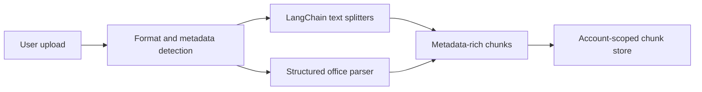
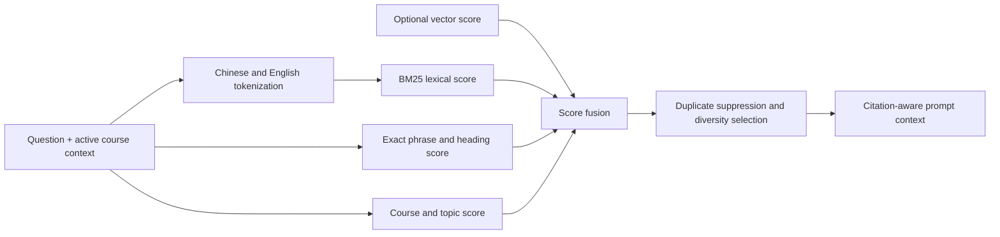

# Retrieval Architecture

Physics Learning Agent uses a lightweight, account-scoped retrieval pipeline for user-owned study materials. The current implementation runs without an external vector database, while preserving the metadata and scoring interfaces needed for a later PostgreSQL/pgvector deployment.

## Ingestion pipeline



The pipeline currently indexes:

- Markdown, TXT, TeX, and CSV through LangChain text splitters
- text-based PDF documents
- DOCX and PPTX course materials
- XLSX, RTF, ODT, ODP, and ODS documents

Scanned PDFs are stored but require a separate OCR step before they become searchable. Old binary DOC and PPT formats are not parsed.

Each chunk can retain:

- document and user identifiers
- source format
- course and topic
- detected language
- section heading
- page, slide, or sheet locator when the source format provides one
- chunk index and character offsets

## Retrieval pipeline



`search.ts` combines BM25, exact phrase matches, heading relevance, and course/topic metadata. Chinese text is indexed with character bigrams and trigrams rather than treating a complete sentence as one token. An optional vector-score map is accepted by the same scorer so a pgvector-backed candidate source can be added without changing prompt construction.

The LangGraph workflow decides whether the personal library is needed, retrieves only documents owned by the signed-in user, and passes source headings and available page/slide locators into the prompt. Answers are instructed to cite retrieved claims with numbered references and never invent page numbers.

## Retrieval evaluation

`evaluation.ts` provides Hit Rate at K and Mean Reciprocal Rank measurements. The test suite includes bilingual physics queries, metadata disambiguation, automatic knowledge-use decisions, document extraction, and citation prompt checks.

Run the retrieval tests with:

```bash
npx vitest run src/rag src/agent/knowledge-mode.test.ts src/lib/personal-knowledge.test.ts
```

## Tencent Cloud migration path

The local file store is appropriate for development and small private tests. A mainland production deployment should move the same logical records to:

1. TencentDB for PostgreSQL for users, conversations, documents, chunks, and retrieval logs.
2. `pgvector` for dense embeddings and HNSW search.
3. Tencent Cloud COS for original PDF, DOCX, and PPTX files.
4. TencentDB for Redis with a background worker for parsing, embedding, and reindexing jobs.

The current chunk metadata maps directly to a future `document_chunks` table. Dense vector results can be fused through the existing `vectorScores` input instead of replacing lexical retrieval.

## Copyright and privacy

Do not commit copyrighted textbooks or protected course materials to the public repository. Upload only user-owned notes, authorized handouts, original problem solutions, and materials the user has permission to process. Retrieval is scoped by account; source files and chunks must never be shared across users.
